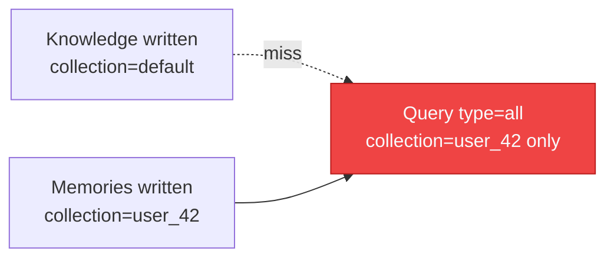
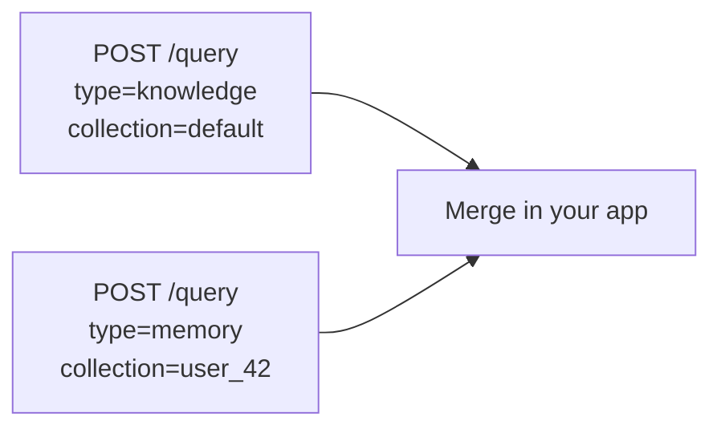

Personalized grounded answers need **shared Knowledge** and **user Memories**. Those usually live in **different collections**. Scope composition decides whether both show up.

Stores refresher: [Knowledge](/essentials/v2/knowledge) · [Memories](/essentials/v2/memories) · [Query `type`](/essentials/v2/query)

---

## The failure mode



A `type: "all"` call still respects collection scope. It does not pull default-collection Knowledge into a user-only query.

---

## Pattern A — Dual query (recommended default)



**Use when:** prompt formatting differs, you want separate citation namespaces, or filters differ per store.

---

## Pattern B — One query with `collections` fanout

```json
{
  "database": "acme_corp",
  "collections": ["default", "user_42"],
  "query": "How do refunds work for my plan?",
  "type": "all",
  "query_by": "hybrid",
  "mode": "thinking"
}
```

**Use when:** both partitions should compete in one ranking and you accept a merged payload.

Details: [Collections Fanout](/essentials/v2/scope-composition/collections-fanout)

---

## Pattern C — Same collection for both (rare)

Only works if you **intentionally** ingest shared Knowledge into the same collection as the user (unusual for multi-user apps). Then `type: "all"` + that collection is consistent — because writes matched reads.

---

## Pattern matrix

| Knowledge collection | Memory collection | Safe query |
| --- | --- | --- |
| `default` | `user_42` | Dual query **or** `collections: ["default","user_42"]` + `type: "all"` |
| `ws_sales` | `user_42` | Dual **or** `collections: ["ws_sales","user_42"]` |
| `user_42` | `user_42` | `type: "all"` + `collection: "user_42"` |
| `default` | (none) | `type: "knowledge"` + default/shared scope |

---

## Worked curl (Pattern B)

```bash
curl -X POST 'https://api.hydradb.com/query' \
  -H "Authorization: Bearer $HYDRA_DB_API_KEY" \
  -H "API-Version: 2" \
  -H "Content-Type: application/json" \
  -d '{
    "database": "acme_corp",
    "collections": ["default", "user_42"],
    "query": "refund policy",
    "type": "all",
    "query_by": "hybrid",
    "mode": "thinking",
    "max_results": 8
  }'
```

---

## Related product docs

Official multi-tenant overview: [Multi-tenant](/essentials/v2/multi-tenant). When that guide’s single-`collection` + `type: "all"` example is used, ensure Knowledge was written under that same collection — or switch to Pattern A/B above.

---

## Next

- [ACL Partitions](/essentials/v2/scope-composition/acl-partitions)
- [Anti-Patterns](/essentials/v2/scope-composition/anti-patterns)
