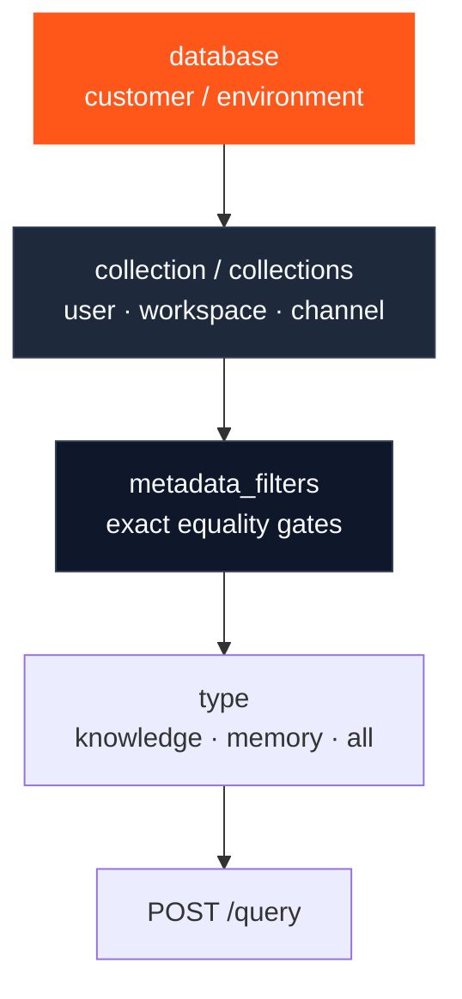

Most “HydraDB returned nothing” and “wrong tenant saw data” bugs are **scope composition** bugs. The APIs are small; the design surface is not.

This playbook teaches how to stack:

1. **`database`** — hard isolation  
2. **`collection` / `collections`** — partitions and fanout  
3. **`metadata_filters`** — equality gates inside a partition  
4. **`type`** — Knowledge, Memories, or both  

It builds on [Multi-tenant](/essentials/v2/multi-tenant), [Query](/essentials/v2/query), and [Metadata](/essentials/v2/metadata). It is not a Memory vs Knowledge primer, auth guide, or query-parameter tuning guide.

---

## The composition stack

| Layer | Job | Wrong use |
| --- | --- | --- |
| `database` | Isolate customers / envs | Two customers in one DB + metadata “security” |
| `collection(s)` | Partition users, teams, channels | Expect default Knowledge when querying only `user_id` |
| `metadata_filters` | Narrow inside a trusted partition | Fake OR/IN with arrays; replace collections |
| `type` | Choose store(s) | `type: "all"` with a partition that never received Knowledge |

---

## Playbook map

<CardGroup cols={2}>
  <Card title="Three Layers" icon="layer-group" href="/essentials/v2/scope-composition/three-layers">
    When to use database vs collection vs metadata — decision rules and diagrams.
  </Card>
  <Card title="Collections Fanout" icon="diagram-project" href="/essentials/v2/scope-composition/collections-fanout">
    `collections` as list or weighted object (max 100) — equal fanout, ranking weights, limits.
  </Card>
  <Card title="Dual-Store Scope" icon="clone" href="/essentials/v2/scope-composition/dual-store">
    Shared Knowledge + user Memories without dropping either side.
  </Card>
  <Card title="ACL Partitions" icon="shield" href="/essentials/v2/scope-composition/acl-partitions">
    Channel- and dept-safe patterns that match HydraDB filter semantics.
  </Card>
  <Card title="Anti-Patterns" icon="triangle-exclamation" href="/essentials/v2/scope-composition/anti-patterns">
    Empty results, leaks, and fanout mistakes — with fixes.
  </Card>
  <Card title="Checklist" icon="list-check" href="/essentials/v2/scope-composition/checklist">
    Ship gate for scope-correct products.
  </Card>
</CardGroup>

---

## One rule

> **You only retrieve what you wrote under the scopes you query.**

If Knowledge was ingested into the default collection and Memories into `user_42`, a single `collection: "user_42"` query will not magically include default Knowledge. Compose deliberately — dual query or `collections` that list **every** partition you need.

---

## Next

Start with [Three Layers](/essentials/v2/scope-composition/three-layers).
