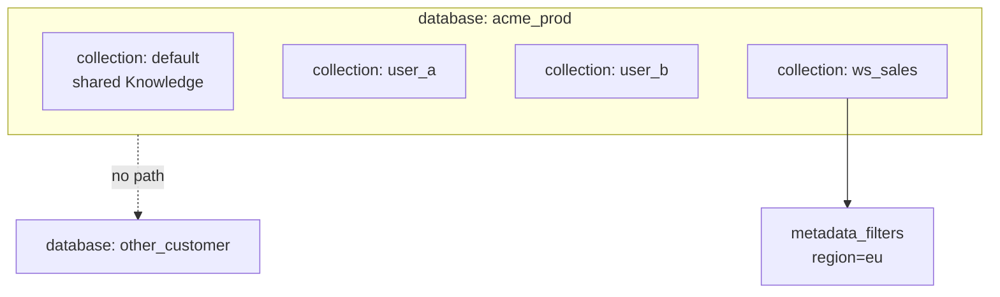
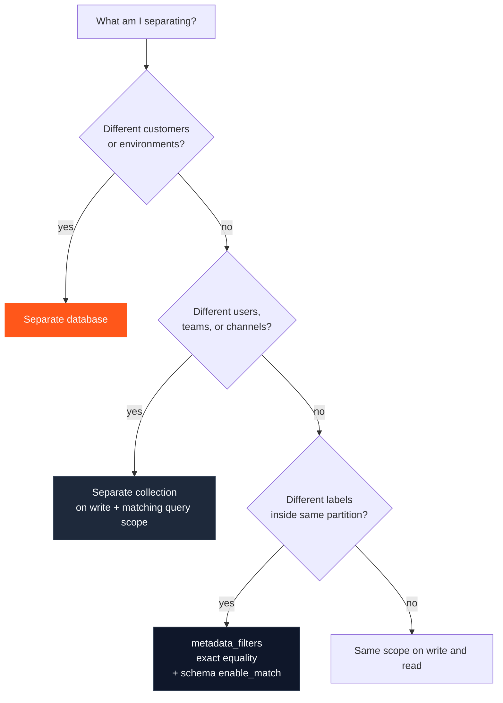

HydraDB gives you three nesting layers. Mixing their jobs is the most common production footgun.

Related: [Multi-tenant](/essentials/v2/multi-tenant) · [Metadata](/essentials/v2/metadata)

---

## Layer cheat sheet

| Layer | Field | Isolates | Cross-read? |
| --- | --- | --- | --- |
| Hard | `database` | Customers, prod vs staging | **Never** across databases |
| Partition | `collection` (write) / `collection` or `collections` (query) | Users, workspaces, channels, projects | Only if you fan out explicitly |
| Filter | `metadata_filters` | Attributes inside a partition (`status`, `dept`) | N/A — narrows candidates |

---

## Decision tree

---

## Write-time vs query-time

| Operation | Scope fields |
| --- | --- |
| Ingest | `database` + optional `collection` (omit → default collection) |
| Query | `database` + `collection` **or** preferred `collections` + optional `metadata_filters` |

**Invariant:** data written under collection `A` is not expected when you query only collection `B`. See [Multi-tenant → How scoping works](/essentials/v2/multi-tenant#4-how-scoping-works).

---

## Product shapes

| Product | `database` | `collection` map |
| --- | --- | --- |
| B2B SaaS | One per customer org (+ env DBs) | Workspace / team / user inside the org |
| B2C app | One app DB (or per region/env) | Usually `user_id` for Memories |
| Internal tools | One company DB | Dept / project; employee for Memories |
| Connector corpora | Company or customer DB | Prefer **one collection per ACL boundary** (e.g. Slack channel) |

---

## Metadata is not a partition

`metadata_filters` run **inside** the selected collection scope. They use **exact equality** (list values are exact set match, not `IN` / `OR`). For OR across values, run multiple queries and union client-side — [Metadata filter semantics](/essentials/v2/metadata#filter-semantics).

**Authorization metadata must be schema-backed** with `enable_match: true`. Undeclared keys are silently ignored — the query behaves as if you sent no filter ([Metadata](/essentials/v2/metadata)). Never use a filter field for ACL until you have verified empty results for a non-matching value.

| Need | Use |
| --- | --- |
| User A must never see user B prefs | `collection` |
| Only `status=approved` docs | `metadata_filters` (+ `enable_match` on `status`) |
| Customer A must never see customer B | `database` |
| Multi-channel ACL | Prefer per-channel `collections`; metadata path only with match-enabled schema — [ACL Partitions](/essentials/v2/scope-composition/acl-partitions) |

---

## Next

- [Collections Fanout](/essentials/v2/scope-composition/collections-fanout)
- [Dual-Store Scope](/essentials/v2/scope-composition/dual-store)
