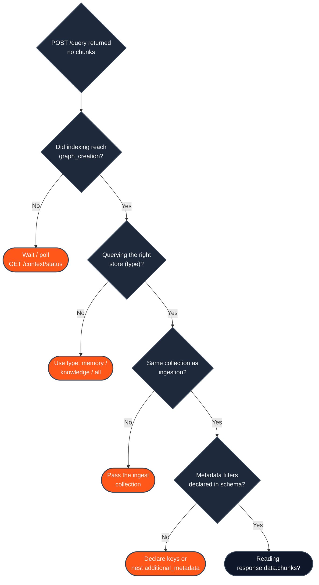

The most common surprise when starting with HydraDB: you ingest content, call [`POST /query`](/api-reference/v2/endpoint/query), and get an empty `chunks` array. Almost always it's one of a handful of causes. Work through them **in order** - each check is cheap, and they're arranged from most to least common.

---

## 1. Indexing hasn't finished

Ingestion is **asynchronous**. The ingest call returns quickly with `queued` IDs, but the content is not queryable until `indexing_status` reaches at least `graph_creation`. Querying before then returns nothing.

**Check:** Poll [`GET /context/status`](/api-reference/v2/endpoint/source-status) with the IDs you got back from ingestion.

**Fix:** Wait until each item is `graph_creation` (queryable) or `completed` (needed only for full graph traversal). Don't query on the first status response - a source is commonly still `queued` or `processing`. You can also [register a webhook](/essentials/v2/webhooks) to be notified when indexing finishes instead of polling.

<Note>
  `graph_creation` is already queryable. Wait for `completed` only when you set `graph_context: true` and need full multi-hop traversal.
</Note>

---

## 2. You're querying the wrong store

Knowledge and Memories live in **separate stores**. [`POST /query`](/api-reference/v2/endpoint/query) reaches each one through the `type` parameter, and querying the wrong store returns nothing even though the content indexed fine.

- Ingested with `type=knowledge` → query with `type: "knowledge"`.
- Ingested with `type=memory` → query with `type: "memory"`.
- Not sure, or you want both → query with `type: "all"`, which searches both stores in parallel.

**Fix:** Match the query `type` to where you ingested, or use `type: "all"`.

---

## 3. Collection scope doesn't match

Memories are scoped by `collection` (formerly `sub_tenant_id`). If you ingest a memory into `collection: "user_123"` but query without a `collection` (or with a different one), you're searching the wrong scope - typically the default collection - and get nothing.

**Check:** Compare the `collection` you passed at ingest with the one you pass at query.

**Fix:** Always query with the same `collection` you ingested into. For per-user (B2C) data, use the user's ID as the `collection` on both calls. On [`POST /query`](/api-reference/v2/endpoint/query), `collections` (plural) is the canonical multi-scope selector.

---

## 4. Metadata filters silently narrow to nothing

Metadata filtering is deterministic and strict, which produces two distinct empty-result traps:

- **Undeclared keys are silently ignored.** A `metadata` key only filters if it's declared in the database schema with `enable_match: true`. Filtering on an undeclared key is ignored at query time - and if you *thought* it was scoping, you may be surprised by the results (or lack of them). See [Metadata](/essentials/v2/metadata).
- **A valid filter with no matches returns empty.** HydraDB does not silently widen a filter into an unfiltered search. If `metadata_filters` matches zero sources, you get zero chunks - by design.
- **`additional_metadata` needs nested syntax.** To filter on an `additional_metadata` field, nest it: `metadata_filters: { additional_metadata: { author: "alice" } }`. Passing it as a top-level key is silently ignored.

**Fix:** Confirm every filter key is either declared in the schema (for `metadata`) or nested under `additional_metadata`. To test whether filters are the cause, re-run the query with no `metadata_filters` - if results come back, a filter was the culprit.

---

## 5. You're reading the wrong field

Every v2 response is wrapped in a standard envelope: `{ success, data, error, meta }`. Query results live under **`response.data.chunks`**, not at the top level. Code that reads `response.chunks` sees `undefined` and looks like an empty result.

**Fix:** Read `response.data.chunks` (and `response.data` for any other payload field).

---

## 6. App sources need the app-aware lane

If you ingested [app sources](/essentials/v2/app-sources) (Slack, Notion, Jira, Gmail via `app_knowledge`) and exact-ID, thread, or actor lookups return nothing, the app-aware retrieval lane may be off. It's disabled by default.

**Fix:** Query with `query_apps: true` and `mode: "thinking"` to enable reconstructed threads, parent/child traversal, and exact ID/actor lookups. App sources live in the Knowledge store, so also use `type: "knowledge"` or `"all"`.

---

## 7. Forceful relations point across stores

If you expected linked content in `additional_context` and it's empty, check two things:

- **Same-store only.** Forceful relations resolve within one store. A Memory item pointing at a Knowledge ID (or vice versa) silently returns nothing.
- **`thinking` mode only.** Forceful-relation context is fetched only when `mode: "thinking"`. In `fast` mode, `query_forceful_relations` has no effect even if set to `true`.

---

## Quick checklist

| Symptom | Likely cause | Fix |
|---|---|---|
| Empty right after ingesting | Indexing not finished | Poll [`/context/status`](/api-reference/v2/endpoint/source-status) to `graph_creation` |
| Empty for content you know exists | Wrong `type` | Use `type: "all"` or match the ingest store |
| Empty for one user's data | `collection` mismatch | Query the same `collection` you ingested into |
| Empty only when filtering | Undeclared or unmatched filter | Declare `metadata` keys; nest `additional_metadata`; test with no filters |
| `chunks` is `undefined` | Reading the wrong field | Read `response.data.chunks` |
| App IDs/threads missing | App lane off | Add `query_apps: true` + `mode: "thinking"` |
| `additional_context` empty | Cross-store or `fast` mode | Keep relations within a store; use `mode: "thinking"` |

---

## Related

- [Query](/essentials/v2/query) - all query parameters and tuning
- [Metadata](/essentials/v2/metadata) - schema-backed filters and the `metadata` vs `additional_metadata` rule
- [Knowledge](/essentials/v2/knowledge) and [Memories](/essentials/v2/memories) - the two stores and their `common mistakes` tables
- [How to Use API Results](/essentials/v2/api-results) - the response envelope in detail
- [Ingestion Status](/api-reference/v2/endpoint/source-status) - the full status lifecycle
