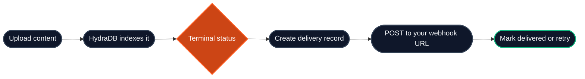

Webhooks let your application receive an HTTP callback when HydraDB finishes processing a document or memory.

Use them when you want to:

- Update your own database when content is ready for query
- Notify users that an upload has finished
- Trigger downstream jobs after indexing completes
- Track indexing failures without polling

<Info>
Webhooks are sent for terminal indexing states. For progress updates before completion, use [Ingestion Status](/api-reference/v2/endpoint/source-status).
</Info>

---

## 1. How it works

When an ingested item reaches a terminal state, HydraDB creates a delivery record and sends a `POST` request to your webhook URL.



The supported event today is:

| Event | When it fires |
|---|---|
| `indexing.status_changed` | When an item reaches `completed`, `errored`, or `success` |

`success` is a legacy alias for `completed`.

---

## 2. Register a webhook

Open the HydraDB dashboard and go to **Webhooks**.

1. Click **Register Webhook**.
2. Enter your public HTTPS endpoint.
3. Select `indexing.status_changed`.
4. Save the webhook.
5. Enable signing and copy the generated secret. It is shown once and cannot be retrieved later.
6. Use **Send Test** to confirm your endpoint receives a request.

Signing is optional but strongly recommended: without it, your endpoint cannot tell a real HydraDB delivery from anything else that can reach the URL. See [Verifying signatures](#5-verifying-signatures).

<Warning>
Your webhook URL must be reachable from the public internet. Localhost and private network addresses are blocked.
</Warning>

<Info>
Webhook management endpoints return their response object directly, not inside the standard v2 `{ success, data, error, meta }` envelope used by `/databases`, `/context/*`, and `/query`.
</Info>

### Register with cURL

Use your HydraDB API key to register a webhook from your backend or terminal.

```bash cURL
curl -X POST 'https://api.hydradb.com/webhooks/indexing' \
  -H "Authorization: Bearer $HYDRADB_API_KEY" \
  -H "API-Version: 2" \
  -H "Content-Type: application/json" \
  -d '{
    "url": "https://api.example.com/webhooks/hydradb",
    "event_types": ["indexing.status_changed"],
    "signing_secret": "replace-with-at-least-16-characters"
  }'
```

**Response:**

```json
{
  "registered": true,
  "url": "https://api.example.com/webhooks/hydradb",
  "event_types": ["indexing.status_changed"],
  "signing_secret_configured": true,
  "message": "Webhook registered."
}
```

`signing_secret` is optional here and must be at least 16 characters if you supply one.

To have HydraDB generate a strong secret instead, send `generate_signing_secret` and register in a single call. The secret comes back once on the response, so registering and enabling signing are one atomic step:

```bash cURL
curl -X POST 'https://api.hydradb.com/webhooks/indexing' \
  -H "Authorization: Bearer $HYDRADB_API_KEY" \
  -H "API-Version: 2" \
  -H "Content-Type: application/json" \
  -d '{
    "url": "https://api.example.com/webhooks/hydradb",
    "event_types": ["indexing.status_changed"],
    "generate_signing_secret": true
  }'
```

**Response:**

```json
{
  "registered": true,
  "url": "https://api.example.com/webhooks/hydradb",
  "event_types": ["indexing.status_changed"],
  "signing_secret_configured": true,
  "signing_secret": "whsec_Yk8sQ2pWc0xuNGRIeUZ0UmJKZ1B3WHZNaTdaYUUxcW8",
  "message": "Webhook registered and signing enabled. Copy the signing secret now - it cannot be retrieved later."
}
```

`generate_signing_secret` and `signing_secret` are mutually exclusive; sending both returns `422`. Whichever you choose, your receiver should verify `X-HydraDB-Signature` on every delivery.

### Check the current registration

```bash cURL
curl 'https://api.hydradb.com/webhooks/indexing' \
  -H "Authorization: Bearer $HYDRADB_API_KEY" \
  -H "API-Version: 2"
```

**Response:**

```json
{
  "registered": true,
  "url": "https://api.example.com/webhooks/hydradb",
  "event_types": ["indexing.status_changed"],
  "signing_secret_configured": true
}
```

### Edit a webhook

Use the same `POST /webhooks/indexing` endpoint to replace the existing registration.

```bash cURL
curl -X POST 'https://api.hydradb.com/webhooks/indexing' \
  -H "Authorization: Bearer $HYDRADB_API_KEY" \
  -H "API-Version: 2" \
  -H "Content-Type: application/json" \
  -d '{
    "url": "https://api.example.com/webhooks/hydradb-v2",
    "event_types": ["indexing.status_changed"],
    "signing_secret": "new-secret-at-least-16-characters"
  }'
```

Omitting `signing_secret` while editing **preserves** the secret you already have. Editing the URL or the event list never changes your signing configuration.

To turn signing off, call `DELETE /webhooks/indexing/signing-secret` explicitly.

### Manage the signing secret

The signing secret has its own endpoint, so enabling, rotating, and disabling are always deliberate actions rather than side effects of editing a registration.

**Generate a secret.** Send no body and HydraDB creates a strong one for you. The secret is returned exactly once, in plain text.

```bash cURL
curl -X POST 'https://api.hydradb.com/webhooks/indexing/signing-secret' \
  -H "Authorization: Bearer $HYDRADB_API_KEY" \
  -H "API-Version: 2"
```

**Response:**

```json
{
  "signing_secret": "whsec_Yk8sQ2pWc0xuNGRIeUZ0UmJKZ1B3WHZNaTdaYUUxcW8",
  "generated": true,
  "message": "Signing secret generated. Copy it now - it cannot be retrieved later, and it takes effect immediately."
}
```

**Supply your own.** Useful when you want to deploy the secret to your receiver first and hand it to HydraDB afterwards, so there is no window where deliveries are signed with a secret your endpoint does not yet know.

```bash cURL
curl -X POST 'https://api.hydradb.com/webhooks/indexing/signing-secret' \
  -H "Authorization: Bearer $HYDRADB_API_KEY" \
  -H "API-Version: 2" \
  -H "Content-Type: application/json" \
  -d '{ "signing_secret": "at-least-16-characters" }'
```

**Disable signing.** This removes the stored secret, and deliveries stop carrying `X-HydraDB-Signature`.

```bash cURL
curl -X DELETE 'https://api.hydradb.com/webhooks/indexing/signing-secret' \
  -H "Authorization: Bearer $HYDRADB_API_KEY" \
  -H "API-Version: 2"
```

<Warning>
Rotating takes effect immediately, with no overlap period. Deliveries in flight during a rotation are signed with the new secret, so a receiver that only knows the old one will reject them. See [Zero-downtime key rotation](#zero-downtime-key-rotation) for how to rotate without a gap.
</Warning>

### Send a test delivery

```bash cURL
curl -X POST 'https://api.hydradb.com/webhooks/indexing/test' \
  -H "Authorization: Bearer $HYDRADB_API_KEY" \
  -H "API-Version: 2"
```

**Response:**

```json
{
  "delivered": true,
  "status_code": 204,
  "message": "Test delivery succeeded."
}
```

### Delete a webhook

```bash cURL
curl -X DELETE 'https://api.hydradb.com/webhooks/indexing' \
  -H "Authorization: Bearer $HYDRADB_API_KEY" \
  -H "API-Version: 2"
```

**Response:**

```json
{
  "deleted": true,
  "message": "Webhook unregistered."
}
```

---

## 3. Request format

HydraDB sends a `POST` request with a JSON body.

### Headers

| Header | Description |
|---|---|
| `Content-Type` | Always `application/json` |
| `X-HydraDB-Delivery-ID` | Stable delivery ID for this event |
| `X-HydraDB-Event` | Event name, such as `indexing.status_changed` |
| `X-HydraDB-Signature` | `sha256=<hex>`, the HMAC-SHA256 of the raw request body keyed by your signing secret. Present only when signing is configured. See [Verifying signatures](#5-verifying-signatures) |

The signature scheme in full:

```
X-HydraDB-Signature: sha256=<lowercase hex digest>

digest = HMAC-SHA256(key = signing_secret, message = raw request body bytes)
```

Three details decide whether your verifier works:

- The `sha256=` prefix is **part of the header value**, not a separate field. Compare against the whole string.
- The digest is **lowercase hex**, not base64.
- The HMAC is computed over the **raw body bytes exactly as received**. Parsing the JSON and re-serialising it produces different bytes and the signature will not match.

### Payload

```json
{
  "event": "indexing.status_changed",
  "delivery_id": "<delivery_id>",
  "id": "<id>",
  "tenant_id": "<database_id>",
  "database": "<database>",
  "sub_tenant_id": "<collection>",
  "collection": "<collection>",
  "status": "completed",
  "timestamp": "<ISO-8601 timestamp>"
}
```

For failed indexing, the payload can include `error_code` and `error_message`:

```json
{
  "event": "indexing.status_changed",
  "delivery_id": "<delivery_id>",
  "id": "<id>",
  "tenant_id": "<database_id>",
  "database": "<database>",
  "sub_tenant_id": "<collection>",
  "collection": "<collection>",
  "status": "errored",
  "timestamp": "<ISO-8601 timestamp>",
  "error_code": "<error_code>",
  "error_message": "<error_message>"
}
```

| Field | Description |
|---|---|
| `event` | Event type. Currently `indexing.status_changed`. |
| `delivery_id` | Stable ID for this event. Store it to deduplicate retries. |
| `id` | The document, memory, or app item ID you supplied during ingestion. |
| `database` | The name of the database you ingested into — the value you sent as `database` (or `tenant_id`) on the ingest request. Empty only for items ingested before this field existed. |
| `collection` | Collection scope for the indexed item. |
| `status` | Terminal indexing status. Usually `completed` or `errored`. |
| `timestamp` | Time the webhook payload was created. |
| `error_code` | Present when available for failed processing. |
| `error_message` | Present when available for failed processing. |
| `tenant_id` | Deprecated. An identifier for the database — not the name you ingested into. Always present. |
| `sub_tenant_id` | Deprecated alias for `collection`, carrying the same value. |

<Note>
Older examples may refer to this document identifier as `doc_id`. New webhook payloads use `id`.
</Note>

<Note>
**`tenant_id` and `database` do not carry the same value.** `database` is the name
you ingested into (`marketing-docs`); `tenant_id` is an identifier for it
(`kv3qz7mabx`). Route and filter on **`database`** — it is the only field that
matches what you sent.

`tenant_id` still carries the same identifier it always has, so integrations
matching on it keep working unchanged. `sub_tenant_id` remains an exact alias for
`collection`. Read `database` and `collection` in new integrations.
</Note>

<Note>
`database` is empty only for items ingested before this field existed. Read
`tenant_id` if you need a scope that is always set.
</Note>

---

## 4. Test delivery payload

The dashboard **Send Test** button sends a synthetic event. It does not create a real indexing delivery.

<Note>
Nothing was ingested, so there is no database name to report: the test payload sets
every scope field — including `database` — to your organisation ID. A real delivery
reports the database you ingested into. Match on `test: true` (or the `test_` prefix
on `delivery_id`) to tell the two apart.
</Note>

```json
{
  "event": "indexing.status_changed",
  "delivery_id": "test_<random>",
  "id": "test_document",
  "tenant_id": "<org_id>",
  "database": "<org_id>",
  "sub_tenant_id": "<org_id>",
  "collection": "<org_id>",
  "status": "completed",
  "timestamp": "<ISO-8601 timestamp>",
  "test": true
}
```

Use `test: true` to ignore test events in production workflows.

---

## 5. Verifying signatures

Verification is one function. It takes your signing secret, the raw request body, and the `X-HydraDB-Signature` header, and returns whether the delivery genuinely came from HydraDB.

If you use an official SDK, it is already there and you can skip the rest of this section:

<CodeGroup>

```python Python SDK
from hydra_db.helpers import verify_webhook_signature

if not verify_webhook_signature(secret, raw_body, signature):
    ...  # reject
```

```typescript TypeScript SDK
import { verifyWebhookSignature } from "@hydradb/sdk/helpers";

if (!verifyWebhookSignature(secret, rawBody, signature)) {
  // reject
}
```

</CodeGroup>

Otherwise, implement it directly. Both use a constant-time comparison, which matters: a naive `==` leaks timing information that can be used to forge a signature byte by byte.

<CodeGroup>

```python Python
import hashlib
import hmac


def verify_webhook_signature(secret: str, raw_body: bytes, signature: str) -> bool:
    """Return True when signature is valid for raw_body."""
    if not secret or not signature:
        return False
    digest = hmac.new(secret.encode(), raw_body, hashlib.sha256).hexdigest()
    return hmac.compare_digest(signature, f"sha256={digest}")
```

```typescript TypeScript
import crypto from "node:crypto";

export function verifyWebhookSignature(
  secret: string,
  rawBody: Buffer,
  signature: string | undefined,
): boolean {
  if (!secret || !signature) {
    return false;
  }
  const expected =
    "sha256=" + crypto.createHmac("sha256", secret).update(rawBody).digest("hex");

  const expectedBuffer = Buffer.from(expected);
  const signatureBuffer = Buffer.from(signature);

  // timingSafeEqual throws on a length mismatch, so guard before comparing.
  if (signatureBuffer.length !== expectedBuffer.length) {
    return false;
  }
  return crypto.timingSafeEqual(signatureBuffer, expectedBuffer);
}
```

</CodeGroup>

<Warning>
Fail closed. If the signing secret is missing from your environment, reject the request rather than skipping verification. A verifier that silently accepts everything when a variable is unset is worse than no verifier, because it looks like it is protecting you.
</Warning>

---

## 6. Receiver examples

Your endpoint should return a `2xx` response quickly. Do any slow work after you acknowledge the request.

These wire the verifier above into a real handler. Note that both read the **raw** body before parsing.

<CodeGroup>

```python Python
import hashlib
import hmac
import json
import os

from fastapi import FastAPI, Header, Request, Response

app = FastAPI()

# Fail fast at startup when the secret is missing, rather than accepting
# unverified deliveries at request time.
SIGNING_SECRET = os.environ["HYDRADB_WEBHOOK_SECRET"]


def verify_webhook_signature(secret: str, raw_body: bytes, signature: str | None) -> bool:
    if not secret or not signature:
        return False
    digest = hmac.new(secret.encode(), raw_body, hashlib.sha256).hexdigest()
    return hmac.compare_digest(signature, f"sha256={digest}")


@app.post("/webhooks/hydradb")
async def hydradb_webhook(
    request: Request,
    delivery_id: str | None = Header(default=None, alias="X-HydraDB-Delivery-ID"),
    signature: str | None = Header(default=None, alias="X-HydraDB-Signature"),
):
    raw_body = await request.body()

    if not verify_webhook_signature(SIGNING_SECRET, raw_body, signature):
        return Response(status_code=401)

    event = json.loads(raw_body)

    # Store delivery_id and skip it if you have already processed it.
    print("HydraDB webhook", delivery_id, event["id"], event["status"])

    return Response(status_code=204)
```

```typescript TypeScript
import crypto from "node:crypto";
import express from "express";

const app = express();

// Fail fast at startup when the secret is missing, rather than accepting
// unverified deliveries at request time.
const signingSecret = process.env.HYDRADB_WEBHOOK_SECRET;
if (!signingSecret) {
  throw new Error("HYDRADB_WEBHOOK_SECRET is required");
}

function verifyWebhookSignature(
  secret: string,
  rawBody: Buffer,
  signature: string | undefined,
): boolean {
  if (!secret || !signature) {
    return false;
  }
  const expected =
    "sha256=" + crypto.createHmac("sha256", secret).update(rawBody).digest("hex");

  const expectedBuffer = Buffer.from(expected);
  const signatureBuffer = Buffer.from(signature);

  if (signatureBuffer.length !== expectedBuffer.length) {
    return false;
  }
  return crypto.timingSafeEqual(signatureBuffer, expectedBuffer);
}

app.post(
  "/webhooks/hydradb",
  // express.raw is essential: the signature covers the raw bytes, so the body
  // must not be parsed before verification.
  express.raw({ type: "application/json" }),
  (req, res) => {
    const deliveryId = req.header("X-HydraDB-Delivery-ID");
    const signature = req.header("X-HydraDB-Signature");
    const rawBody = req.body as Buffer;

    if (!verifyWebhookSignature(signingSecret, rawBody, signature)) {
      return res.status(401).send("Invalid signature");
    }

    const event = JSON.parse(rawBody.toString("utf8"));

    // Store deliveryId and skip it if you have already processed it.
    console.log("HydraDB webhook", deliveryId, event.id, event.status);

    return res.status(204).send();
  }
);

app.listen(3000);
```

</CodeGroup>

---

## 7. Delivery and retries

HydraDB records every delivery attempt. You can inspect delivery history from the dashboard Webhooks page.

Delivery states:

| State | Meaning |
|---|---|
| `pending` | The event was recorded and is waiting to be sent. |
| `sweeping` | HydraDB has claimed the event for delivery or retry. |
| `delivered` | Your endpoint returned a successful status code. |
| `failed` | The current send attempt failed and will be retried. |
| `permanently_failed` | HydraDB stopped retrying this event. |

HydraDB retries failed deliveries in the background. If a worker shuts down during delivery, the sweep process recovers the event later.

Your receiver should be idempotent:

- Store `delivery_id`.
- If the same `delivery_id` arrives again, return `2xx` without repeating side effects.
- Do not depend on receiving events exactly once.

### List deliveries with cURL

```bash cURL
curl 'https://api.hydradb.com/webhooks/indexing/deliveries?limit=20' \
  -H "Authorization: Bearer $HYDRADB_API_KEY" \
  -H "API-Version: 2"
```

**Response:**

```json
{
  "deliveries": [
    {
      "delivery_id": "<delivery_id>",
      "doc_id": "<id>",
      "status": "delivered",
      "indexing_status": "completed",
      "event_type": "indexing.status_changed",
      "attempts": 1,
      "error_code": null,
      "error_message": null,
      "created_at": "<ISO-8601 timestamp>",
      "updated_at": "<ISO-8601 timestamp>"
    }
  ],
  "count": 1,
  "next_cursor": null
}
```

Delivery history uses `doc_id` internally. The outbound webhook payload uses `id`.

### Filter deliveries

```bash cURL
curl 'https://api.hydradb.com/webhooks/indexing/deliveries?limit=20&status=failed' \
  -H "Authorization: Bearer $HYDRADB_API_KEY" \
  -H "API-Version: 2"
```

Valid filters are:

- `pending`
- `sweeping`
- `delivered`
- `failed`
- `permanently_failed`

### Paginate deliveries

When `next_cursor` is not `null`, pass it back as `cursor`.

```bash cURL
curl 'https://api.hydradb.com/webhooks/indexing/deliveries?limit=20&cursor=<next_cursor>' \
  -H "Authorization: Bearer $HYDRADB_API_KEY" \
  -H "API-Version: 2"
```

`limit` can be between `1` and `100`.

### Get one delivery

Replace `<delivery_id>` with a value from a webhook payload or from the delivery list response.

```bash cURL
curl 'https://api.hydradb.com/webhooks/indexing/deliveries/<delivery_id>' \
  -H "Authorization: Bearer $HYDRADB_API_KEY" \
  -H "API-Version: 2"
```

### Retry a failed delivery

Only `failed` and `permanently_failed` deliveries can be retried manually.

```bash cURL
curl -X POST 'https://api.hydradb.com/webhooks/indexing/deliveries/<delivery_id>/retry' \
  -H "Authorization: Bearer $HYDRADB_API_KEY" \
  -H "API-Version: 2"
```

**Response:**

```json
{
  "delivery_id": "<delivery_id>",
  "queued": true,
  "message": "Delivery queued for retry."
}
```

---

## 8. Advanced patterns

### Zero-downtime key rotation

Rotating takes effect immediately and HydraDB signs each delivery with exactly one secret, so a naive rotation leaves a window where deliveries are signed with a secret your receiver does not have yet. Every delivery in that window fails verification, and a correct receiver rejects them.

The fix is to make the change on your side first, and overlap the two secrets in your own receiver. That requires knowing the new secret before HydraDB starts using it, which is why you supply it yourself rather than having one generated.

<Steps>
  <Step title="Choose the new secret yourself">
    Generate a high-entropy value with your own tooling, for example `openssl rand -base64 32`. Do not use the generate option here: a generated secret is only revealed after it is already in effect, which is exactly the window you are trying to avoid.
  </Step>
  <Step title="Teach your receiver both secrets">
    Deploy your receiver so it accepts either the current secret or the new one, reading both from your environment. At this point nothing has changed on the HydraDB side, so every delivery still verifies against the old secret.
  </Step>
  <Step title="Rotate in HydraDB, supplying that secret">
    In the dashboard, open **Rotate**, tick **I'll use my own secret**, and paste the value. Over the API, `POST /webhooks/indexing/signing-secret` with a `signing_secret` body. Deliveries switch to the new secret immediately, and your receiver already accepts it.
  </Step>
  <Step title="Retire the old secret">
    Once you have confirmed deliveries are verifying against the new secret, remove the old one from your receiver and redeploy. You are back to a single active secret.
  </Step>
</Steps>

A receiver that accepts either secret:

<CodeGroup>

```python Python
import hashlib
import hmac
import os

# During a rotation both are set. Afterwards, drop HYDRADB_WEBHOOK_SECRET_OLD.
SECRETS = [
    s for s in (
        os.environ["HYDRADB_WEBHOOK_SECRET"],
        os.environ.get("HYDRADB_WEBHOOK_SECRET_OLD"),
    ) if s
]


def verify_webhook_signature(raw_body: bytes, signature: str) -> bool:
    if not signature:
        return False
    for secret in SECRETS:
        digest = hmac.new(secret.encode(), raw_body, hashlib.sha256).hexdigest()
        if hmac.compare_digest(signature, f"sha256={digest}"):
            return True
    return False
```

```typescript TypeScript
import crypto from "node:crypto";

// During a rotation both are set. Afterwards, drop HYDRADB_WEBHOOK_SECRET_OLD.
const secrets = [
  process.env.HYDRADB_WEBHOOK_SECRET,
  process.env.HYDRADB_WEBHOOK_SECRET_OLD,
].filter((s): s is string => Boolean(s));

export function verifyWebhookSignature(rawBody: Buffer, signature: string | undefined): boolean {
  if (!signature) {
    return false;
  }
  return secrets.some((secret) => {
    const expected =
      "sha256=" + crypto.createHmac("sha256", secret).update(rawBody).digest("hex");
    const expectedBuffer = Buffer.from(expected);
    const signatureBuffer = Buffer.from(signature);
    if (signatureBuffer.length !== expectedBuffer.length) {
      return false;
    }
    return crypto.timingSafeEqual(signatureBuffer, expectedBuffer);
  });
}
```

</CodeGroup>

<Note>
The overlap lives in your receiver, not in HydraDB. Each delivery carries a single `X-HydraDB-Signature` value, so accepting two secrets is something your code does during the changeover. Keep the window short and remove the old secret once the rotation is confirmed.
</Note>

---

## 9. Security checklist

- Use HTTPS for your webhook URL.
- Enable signing and let HydraDB generate the secret. A secret you invent yourself is usually far weaker than one from a CSPRNG, and a weak secret makes the signature decorative.
- Verify `X-HydraDB-Signature` using the raw request body, with a constant-time comparison.
- Fail closed. Reject the request when the secret is missing from your environment, rather than skipping verification.
- Store the secret as a secret. It belongs in your secret manager, not in source control.
- Return `2xx` only after you accept the event.
- Deduplicate using `delivery_id`.
- Keep the endpoint fast. Put slow work in a queue or background job.

---

## 10. Common issues

| Issue | What to check |
|---|---|
| Test delivery fails | Confirm your endpoint is public and returns a `2xx` status. |
| Signature check fails | Verify the HMAC is computed over the raw request body, not parsed JSON. Check you are comparing against the whole header value including the `sha256=` prefix, and that the digest is lowercase hex rather than base64. |
| Signature header is missing | Signing is not configured. Call `POST /webhooks/indexing/signing-secret` to enable it. |
| Signatures started failing after a rotation | Rotation applies immediately. Confirm your receiver has the new secret deployed, and see [Zero-downtime key rotation](#zero-downtime-key-rotation) to avoid the gap next time. |
| Event arrives more than once | This is expected during retries. Deduplicate with `delivery_id`. |
| Event never arrives | Check the dashboard delivery history for `failed` or `permanently_failed`. |
| `id` is unexpected | It is the ID you supplied at ingestion, such as document ID, memory ID, or app item ID. |
