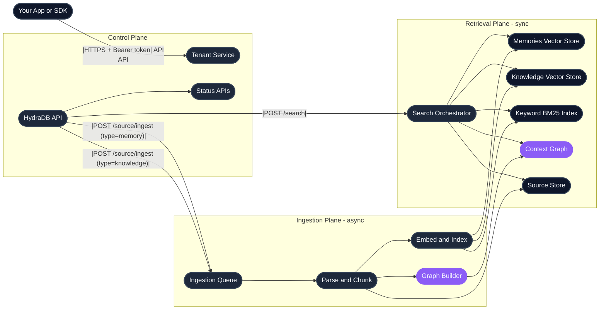
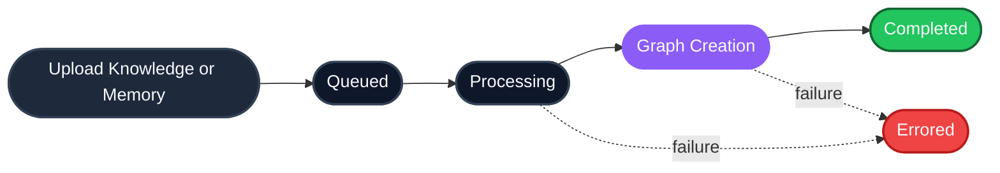

HydraDB is context infrastructure for AI agents. You call a small set of HTTP APIs. Behind the service boundary, HydraDB handles tenant isolation, asynchronous ingestion, graph construction, and hybrid retrieval. This page explains what happens and why it matters for how you build.

---

## The big picture

HydraDB organizes its work into three logical planes. You interact with the API.

| Plane | What it handles |
| --- | --- |
| **Control** | Tenant lifecycle, provisioning, and status |
| **Ingestion** | Document and app knowledge uploads, memory writes,  and graph construction |
| **Retrieval** | Graph traversal, index search, and response shaping |

\[todo\]: revisit and improve the mermaid 

---

## Complete ingestion lifecycle

Ingestion is asynchronous. A successful call means HydraDB accepted the work and queued it. Context is not immediately searchable.

Two things to know:

- `graph_creation` is already searchable.\*\* Chunks are retrievable as soon as embedding finishes. Wait for `completed` only if you need full graph context on queries. 
- **Failures surface with detail.** An `errored` status returns an `error_code` and `message`. Parse failures, validation problems, and infrastructure issues are each distinguishable. 

---

## **From ingestion to querying**

1. **Create a tenant** with `POST /tenants`. Your isolated workspace. Declare a metadata schema upfront if you plan to filter on structured fields. 
2. **Wait for provisioning** by polling `GET /tenants/status` until `vectorstore_status.knowledge`, `vectorstore_status.memories`, and `graph_status` are all `true`. 
3. **Ingest content** with `POST /source/ingest`. Use `type=knowledge` for shared documents, `type=memory` for per-user context. 
4. **Confirm indexing** by polling `GET /source/status` until each `source_id` reaches `completed`. 
5. **Query** with `POST /search`. Set `type` to `knowledge`, `memory`, or `all`. Set `search_by` to `hybrid` (default) or `text` for BM25 only. 

What changes between integrations is what goes into metadata, what you query with, and which `type` and `search_by` combination fits the task.

---

## Related

- [Core Concepts](/get-started/core-concepts)  -  the five primitives: Memories, Knowledge, Search, Tenants, Metadata
- [Quickstart](/get-started/v2/quickstart)  -  build your first integration in five minutes
- [Knowledge](/essentials/v2/knowledge) and [Memories](/essentials/v2/memories)  -  the two content models
- [Search](/essentials/v2/search)  -  deep dive on `POST /search`
- [Multi-Tenant Support](/essentials/v2/multi-tenant)  -  scoping patterns and pitfalls
- [Metadata](/essentials/v2/metadata)  -  designing filterable fields