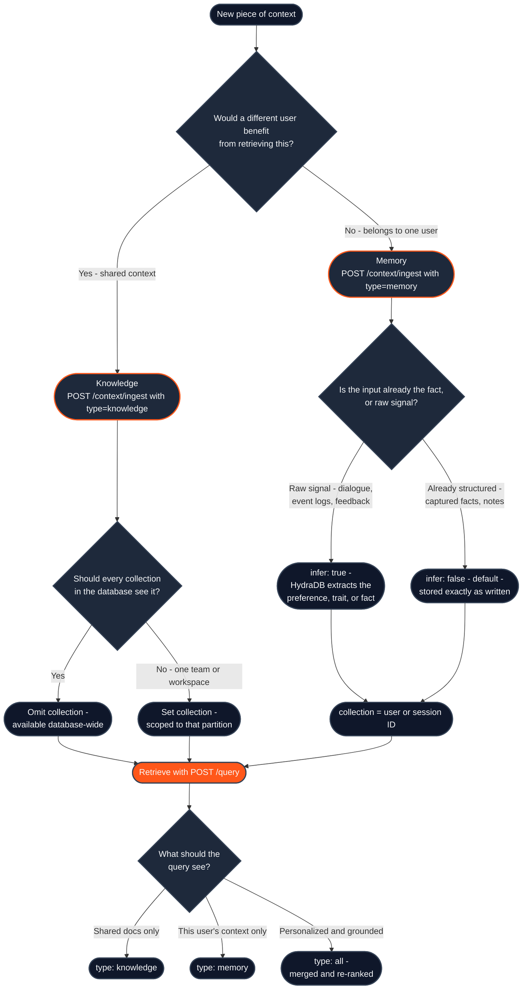

Every piece of context you send to HydraDB goes through the same four decisions. Most integration bugs - empty query results, memories surfacing for the wrong user, preferences stored as raw logs - come from getting one of them wrong. This page is the map; each decision links to the page that covers it in depth.

1. **Store** - is this [Knowledge](/essentials/v2/knowledge) or a [Memory](/essentials/v2/memories)?
2. **Inference** - should HydraDB store it verbatim, or extract the underlying fact (`infer`)?
3. **Scope** - which `database` and `collection` should own it?
4. **Retrieval** - which `type` (and `mode`) gets it back at query time?

## The decision tree

---

## Decision 1 - Knowledge or Memory?

Ask one question: **would a different user benefit from retrieving this?**

| If the content is… | Store it as… | Because… |
|---|---|---|
| Product docs, policy PDFs, wikis, Slack exports | [Knowledge](/essentials/v2/knowledge) | Shared, versioned, replaced explicitly |
| A user's preferences, traits, or conversation history | [Memory](/essentials/v2/memories) | Per-user, evolves with every interaction |
| App records everyone should query (tickets, CRM rows) | [Knowledge](/essentials/v2/knowledge) via [app sources](/essentials/v2/app-sources) | Shared but app-structured |
| A decision made in one user's session | [Memory](/essentials/v2/memories) | Only meaningful for that user's future answers |

Both stores are written through the same [`POST /context/ingest`](/api-reference/v2/endpoint/ingest-context) endpoint - the `type` field picks the store. They are separate at the storage layer, which is why querying the wrong store returns nothing rather than erroring. The full side-by-side comparison lives in [Knowledge](/essentials/v2/knowledge#1-what-it-is).

## Decision 2 - `infer: true` or `infer: false`? (Memories only)

The `infer` flag decides who does the extraction work:

- **`infer: true`** - you send raw signal (dialogue, behavior logs, feedback) and HydraDB extracts the durable fact. Sending a week of theme-toggle events yields `"user prefers dark mode"`, not the event log. Guide extraction with `custom_instructions`.
- **`infer: false`** (the default) - HydraDB stores exactly what you send. Right for facts you already captured ("plan tier is Pro") and content you want back verbatim. Faster and deterministic.

Two common inversions to avoid: sending raw conversation with `infer: false` stores noise instead of the preference; sending a clean fact with `infer: true` may get re-phrased. See [choosing whether HydraDB should infer](/essentials/v2/memories#choose-whether-hydradb-should-infer-the-memory) for worked examples.

Knowledge has no `infer` flag - documents are always parsed, chunked, and graph-extracted by the [ingestion pipeline](/essentials/v2/knowledge#2-what-it-does).

## Decision 3 - Which database and collection?

A `database` is a fully isolated workspace; a `collection` is a logical partition inside it (formerly `tenant_id` / `sub_tenant_id` - see [Multi-Tenant](/essentials/v2/multi-tenant)).

| Pattern | `database` | `collection` |
|---|---|---|
| **B2C app** | Your product | One per end user (`user_john_123`) |
| **B2B app** | One per customer | One per team or department |
| **Shared knowledge, all users** | The workspace | Omit - visible to every collection |
| **Team-scoped knowledge** | The workspace | The team's collection |
| **Per-user memories** | The workspace | Always the user's ID |

The single most expensive mistake here: **omitting `collection` on memory ingestion**. The memory lands in the default collection and can surface for the wrong user. Scope memories to the narrowest unit that should retrieve them.

## Decision 4 - How do you query it back?

One endpoint - [`POST /query`](/api-reference/v2/endpoint/query) - reads both stores. Your write-time choices determine the read-time parameters:

| You stored… | Query with… |
|---|---|
| Knowledge | `type: "knowledge"` |
| Memories | `type: "memory"` and the same `collection` you wrote to |
| Both, want personalized grounded answers | `type: "all"` - both stores run in parallel, results merged and re-ranked |

Two follow-on switches worth knowing before production:

- **`mode`**: `"fast"` skips graph expansion for latency; `"thinking"` enables [forceful-relation](/essentials/v2/knowledge#7-forceful-relations) expansion and deeper graph context. If you declared relations at ingest, query in `thinking` mode - in `fast` mode the flag is silently ignored.
- **Timing**: ingestion is asynchronous. Content becomes queryable at `indexing_status: graph_creation` and fully graph-traversable at `completed` - poll [`GET /context/status`](/api-reference/v2/endpoint/source-status) or register a [webhook](/essentials/v2/webhooks) before you query.

Full parameter tuning (`query_by`, `graph_context`, `recency_bias`, metadata filters) is covered in [Query](/essentials/v2/query).

---

## Ten scenarios, decided

| # | Scenario | Store | `infer` | `collection` | Query `type` |
|---|---|---|---|---|---|
| 1 | Company handbook PDF | Knowledge | - | omit | `knowledge` |
| 2 | "User prefers concise answers" (already extracted) | Memory | `false` | user ID | `memory` |
| 3 | Raw chat transcript with implied preferences | Memory | `true` | user ID | `memory` |
| 4 | Slack thread with a pricing decision | Knowledge (app source) | - | omit or team | `knowledge` |
| 5 | A week of UI event logs | Memory | `true` | user ID | `memory` |
| 6 | Legal team's internal runbook | Knowledge | - | `legal` | `knowledge` |
| 7 | "Plan tier: Pro" from your billing system | Memory | `false` | user ID | `memory` |
| 8 | Personalized answer over shared docs | both stores | per row above | per row above | `all` |
| 9 | Jira tickets synced for the whole org | Knowledge ([connector](/essentials/v2/connectors)) | - | omit | `knowledge` |
| 10 | Meeting notes only one exec should see | Memory | `false`, `is_markdown: true` | exec's ID | `memory` |

## Common traps

| Trap | Symptom | Fix |
|---|---|---|
| Stored as Knowledge, queried with `type: "memory"` (or vice versa) | Empty results, no error | Match the query `type` to the store you wrote to, or use `"all"` |
| Memory ingested without `collection` | Context leaks into the default scope | Always pass the user's ID as `collection` for per-user data |
| Querying immediately after ingest | Empty results that "fix themselves" later | Poll [`/context/status`](/api-reference/v2/endpoint/source-status) until at least `graph_creation` |
| Relations declared but queried in `fast` mode | `additional_context` always empty | Set `mode: "thinking"` |
| Raw dialogue stored with `infer: false` | Retrieval returns transcripts, not preferences | Set `infer: true` for conversational input |

## Next steps

<CardGroup cols={2}>
  <Card title="Quickstart" icon="rocket" href="/get-started/v2/quickstart">
    Run the full create → ingest → verify → query loop in five minutes.
  </Card>
  <Card title="Memories deep dive" icon="brain" href="/essentials/v2/memories">
    Input shapes, the infer flag, and forceful relations.
  </Card>
  <Card title="Knowledge deep dive" icon="book" href="/essentials/v2/knowledge">
    File and app-source ingestion paths, metadata, verification.
  </Card>
  <Card title="Query" icon="magnifying-glass" href="/essentials/v2/query">
    Tuning hybrid retrieval, modes, and graph context.
  </Card>
</CardGroup>
