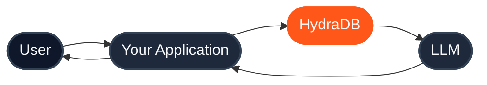
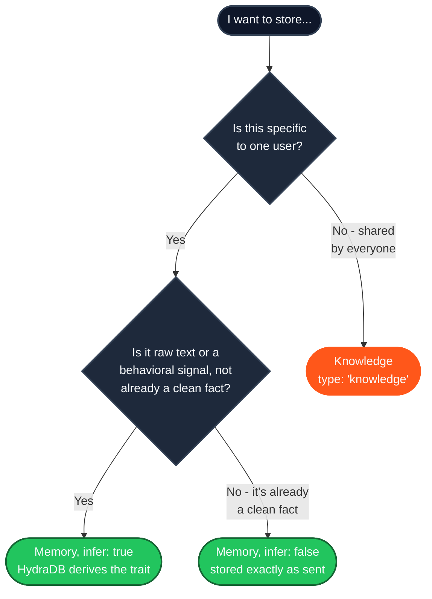
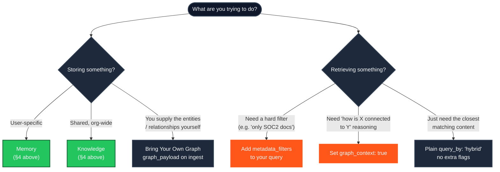
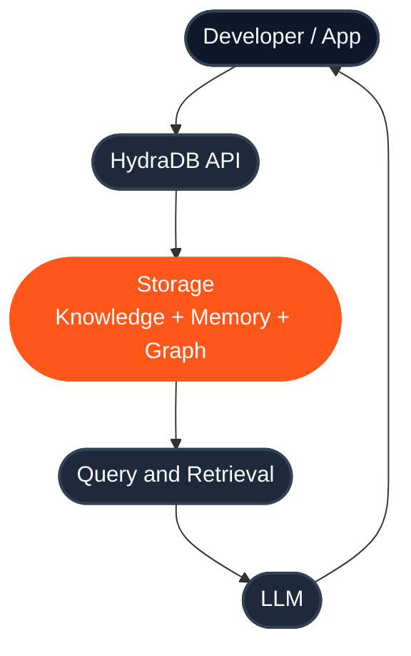

Every concept in HydraDB - Memory, Knowledge, Context, Query, Databases, Collections, Metadata, Graph - has its own deep-dive page. What's missing is the page that connects them. This is that page: the one to read before anything else, so that every other page in these docs slots into a model you already have instead of adding one more disconnected term.

Nothing here replaces the pages it links to. It's the map, not the territory.

---

## 1. What is HydraDB?

HydraDB is context infrastructure for AI agents: one API that stores what your users tell you (**Memories**), what your organization knows (**Knowledge**), and the relationships between them (**Graph**) - then returns the right slice of it, personalized to the user asking, in one retrieval call.

The problem it solves: a vector database finds what's *similar*. It doesn't know that "Python" the language and "Python" the snake are different things, can't tell you who owns an escalation, and returns the same result to every user regardless of who's asking. Most teams end up stitching a vector store, a graph database, a cache, and a homemade personalization layer together to work around this - four systems to run, four places for retrieval quality to quietly degrade.

HydraDB is that stitching, done once, behind one API.

| If you're evaluating... | It's good at | Where HydraDB differs |
|---|---|---|
| **A vector DB** (Pinecone, Weaviate, etc.) | Fast nearest-neighbor search over embeddings | Adds a relationship graph, native per-user memory, and multi-tenant isolation - so you're not bolting personalization onto raw vector search yourself |
| **Redis** | Low-latency key-value caching | Redis doesn't parse, chunk, embed, or semantically search content - HydraDB is a retrieval system, not a cache |
| **Postgres / pgvector** | Relational storage, some vector search at small scale | You own chunking, embedding, graph modeling, and tenant isolation by hand; HydraDB does that natively and scales past the point pgvector gets awkward |
| **A generic RAG framework** | Flexible, you control every step | Flexibility is also the cost: you write and maintain the ingestion pipeline, the ranking logic, and the multi-user isolation yourself. HydraDB trades some of that low-level control for not building it at all |

<Note>
This is a real trade-off, not a strictly-better claim. If you need full control over embedding models, chunking strategy, or graph schema at the storage layer, a hand-built stack may suit you better. HydraDB is built for teams who want that stack's outcome without operating it.
</Note>

---

## 2. How HydraDB thinks

Before any implementation detail, hold this shape in your head:



Your application never asks the LLM to remember things, and it never asks a bare vector store to guess at relevance. It asks HydraDB one question - *"what does this user need to know, right now, to answer this?"* - and HydraDB answers using everything it has stored: what this specific user has told you, what your organization knows, and how those things connect. Your application hands that answer to the LLM as context. The LLM never touches storage directly, and your application never touches embeddings, chunking, or ranking directly.

Everything past this point in HydraDB is in service of making that one arrow - `App → HydraDB` - return the right thing.

---

## 3. Core concepts, in one table

Every primitive you'll touch, what it's for, and - just as importantly - what it isn't for. Each links to its full page; this row is the whole thing you need to keep in your head day-to-day.

| Concept | What it is | Use it for | Don't use it for |
|---|---|---|---|
| **Memory** | User-scoped preferences, history, and inferred traits | Personalizing retrieval to *who's asking* | Content shared across all users - that's Knowledge |
| **Knowledge** | Shared documents, app content, and organizational facts | Docs, wikis, product content everyone should be able to retrieve | Anything private to one user - that's Memory |
| **Context** | The umbrella: everything ingested becomes context; everything `POST /query` returns is a context payload | Thinking about ingestion and retrieval as one system, not two | A concept you configure directly - there's no `type: "context"`; you always pick `knowledge`, `memory`, or `all` |
| **Query** | The single retrieval endpoint - `POST /query` | Reading anything back out of HydraDB, tuned by `type`, `query_by`, and `mode` | Writing data - that's `POST /context/ingest` |
| **Inference** | The `infer: true` flag on memory ingestion, which turns raw text or behavioral logs into a structured, derived trait | Shipping raw signals (chat turns, UI events) and letting HydraDB extract the preference | Facts you've already structured yourself - use `infer: false` (the default) and store them as-is |
| **Metadata** | Two tiers: schema-declared `metadata` (deterministic, filterable) and free-form `additional_metadata` | Hard filters production systems need - "only approved docs," "only Engineering" | Separating users, customers, or environments - that's what `database`/`collection` are for, not metadata |
| **Database** | The top-level isolation boundary. No database can read another's data | Separating customers or environments | Separating users *within* one customer - that's a Collection |
| **Collection** | A logical partition inside a database | Users, teams, workspaces, projects | Separating environments (prod vs. staging) - use a separate database |
| **Sources** | The addressable unit behind ingested content - a document, app item, or memory, identified by a `source_id` | Referencing, updating, or deleting one specific thing you ingested | Querying - sources are what you get *back*, not what you search with |
| **Graph** | The relationship layer connecting entities extracted from your content (or supplied directly) | "How is X connected to Y" reasoning that similarity search alone misses | Simple lookups where nothing needs to be connected - skip `graph_context` and save latency |
| **Embeddings** | An internal step in the ingestion pipeline (parse → chunk → **embed** → index) | Nothing you call directly - HydraDB has no public embeddings endpoint in v2 | Don't expect to choose an embedding model or call an embed API; that's intentionally abstracted. See [Architecture](/essentials/v2/architecture#ingestion-lifecycle) for where this happens |
| **Relationships** | The `source → relation → target` triplets that make up the Graph | Understanding *why* two pieces of context are related, via `query_paths` / `chunk_relations` | A replacement for `metadata_filters` - relationships describe connections, not filter conditions |

<Info>
"Embeddings" is listed here because new developers reasonably expect an API for it. In HydraDB v2, it isn't one - embedding happens automatically as part of `POST /context/ingest`, and nothing in the public API lets (or requires) you to manage it directly.
</Info>

Deep dives: [Knowledge](/essentials/v2/knowledge) · [Memories](/essentials/v2/memories) · [Query](/essentials/v2/query) · [Metadata](/essentials/v2/metadata) · [Multi-Tenant (Database/Collection)](/essentials/v2/multi-tenant) · [Context Graphs](/essentials/v2/context-graphs) · [App Sources](/essentials/v2/app-sources)

---

## 4. Memory vs. Knowledge

This is the first fork every new integration hits, so it earns its own section.

| | Memory | Knowledge |
|---|---|---|
| **Holds** | Preferences, conversation history, inferred traits | Documents, files, app-generated content |
| **Scope** | Per-user, via `collection` | Shared across a database (or scoped, if you choose) |
| **Changes** | Continuously - compounds with every interaction | Versioned - replaced or deleted explicitly |
| **Query `type`** | `"memory"` | `"knowledge"` |
| **Ingest with** | `POST /context/ingest`, `type: "memory"`, optional `infer: true` | `POST /context/ingest`, `type: "knowledge"` |

**Decision tree:**



**Real examples:**

- *"User prefers dark mode and concise answers"* → Memory, `infer: true` (it's a user-specific trait derived from a stated preference)
- *"Q4 refund policy PDF"* → Knowledge (shared, and nobody's personal data)
- *"Support ticket #4471 was resolved by restarting the sync job"* → Knowledge if any agent should learn from it, Memory if it's specific to how *this customer's* issues tend to resolve
- *"user_id: alex, last_active: 2026-07-01"* → Memory, `infer: false` (it's already a clean, structured fact - no extraction needed)

**Common mistakes:**

- **Putting shared docs in Memory.** If it should be retrievable by every user, it's Knowledge, not a Memory written under a shared collection.
- **Putting personal data in Knowledge.** Knowledge scoped to a database is visible to every collection that queries it by default - don't rely on Knowledge scoping to keep one user's data from another.
- **Defaulting to `infer: false` for everything.** Raw signals (chat logs, click events) are exactly what `infer: true` is for; storing them un-inferred just pushes the extraction work into your own application code.
- **Forgetting `type: "all"` exists.** Most personalized-answer use cases want both stores merged in one call, not two separate ones - see [Query](/essentials/v2/query).

---

## 5. The developer decision tree

The broader version of the tree above, covering where metadata and the graph fit in too:



None of these are mutually exclusive - a single `POST /query` call commonly combines a `type`, `metadata_filters`, and `graph_context: true` at once. The tree is about which knobs are relevant to *this* question, not which one call to make.

---

## 6. The complete picture

A 10,000-foot view of the whole round trip. For the detailed version - the three internal planes, the async ingestion state machine, and every endpoint involved - see [Architecture](/essentials/v2/architecture).



The one detail worth internalizing at this level: **storage and retrieval run on different clocks.** Ingestion is asynchronous - your upload returns quickly, then HydraDB parses, embeds, and graphs the content in the background. Query is synchronous and only ever reads what's already indexed. Every "I ingested it but query returns nothing" problem traces back to this line.

---

## 7. End-to-end: an AI customer support assistant

One realistic build, step by step, using the exact calls you'd use in production. This is the compressed version - for the full working guide with error handling and conversation storage, see the [Customer Support Agent cookbook](/cookbooks/v2/customer-support-agent).

<Steps>

<Step title="Create a database">

One database for the support system. Each customer becomes a collection inside it - created automatically on first write, no setup required.

```python
import os
from hydra_db import HydraDB

client = HydraDB(token=os.environ["HYDRA_DB_API_KEY"])
database = "customer-support"

client.databases.create(database=database)
```

</Step>

<Step title="Ingest docs as Knowledge">

Help articles and past ticket resolutions go in once, shared across every customer and every agent.

```python
client.context.ingest(
    type="knowledge",
    database=database,
    files=[("refund-policy.pdf", open("refund-policy.pdf", "rb"), "application/pdf")],
)
```

</Step>

<Step title="Store per-customer Memories">

Every conversation turn and inferred preference is written under that customer's own `collection`.

```python
client.context.ingest(
    type="memory",
    database=database,
    collection="customer_482",
    memories=[
        {"text": "Enterprise plan. Prefers email over chat.", "infer": True}
    ],
)
```

</Step>

<Step title="Query both stores in one call">

When a ticket comes in, retrieve the customer's context and the relevant knowledge together with `type: "all"`.

```python
result = client.query(
    database=database,
    collection="customer_482",
    type="all",
    query="my refund hasn't shown up yet",
    mode="thinking",
)
```

</Step>

<Step title="Pass the result to your LLM">

`result.data.chunks` carries the ranked, merged context - the customer's plan and history alongside the relevant policy text. Format it into your prompt (see [How to Use API Results](/essentials/v2/api-results)) and generate the response.

</Step>

<Step title="Write the turn back as a Memory">

Store the resolution as a new memory under the same collection, so the next ticket from this customer starts one step ahead.

```python
client.context.ingest(
    type="memory",
    database=database,
    collection="customer_482",
    memories=[
        {"text": "Refund delay resolved - payment provider outage, refund reissued.", "infer": True}
    ],
)
```

</Step>

</Steps>

That loop - ingest, query, respond, write back - is the shape of nearly every HydraDB integration, regardless of what the agent actually does.

---

## 8. Common beginner mistakes

- **Choosing Memory when the content is actually Knowledge (or vice versa).** See §4 - this is the single most common source of "why can't the other user see this" or "why is my personal data showing up for everyone" bugs.
- **Confusing `metadata` with `additional_metadata`.** `metadata` fields must be declared in the database's schema up front and are what you filter on at scale; `additional_metadata` is free-form and not schema-checked. Using the free-form field for something you need to filter on every query means declaring it properly later, after the fact.
- **Querying before ingestion has finished.** Ingestion is async (§6). Poll `GET /context/status` until the item reaches `completed` (or at least `graph_creation`) before assuming a missing result means something's wrong.
- **Writing and reading under different `collection` values.** Data written under one collection will not appear when you query a different one. Keep the identifier stable and consistent - see [Multi-Tenant](/essentials/v2/multi-tenant#6-common-mistakes) for the full list.
- **Always reaching for `mode: "thinking"`.** It's more thorough (query expansion, reranking) and higher latency. Start with the `"fast"` default and upgrade only where retrieval quality actually needs it.
- **Setting `graph_context: true` on every call "just in case."** It's the right tool for relationship questions, not a free quality boost - it costs latency for queries that don't need it.
- **Treating `database` and `collection` as interchangeable.** Use a separate database when data must never mix (different customers, different environments). Use a collection for partitions inside one database (users, teams). Mixing the two up is the second-most common scoping bug after the one above.

---

## 9. Best practices

- **Pick your database/collection shape before you ingest anything.** B2B: one database per customer, collections for their teams. B2C: one database for your app, one collection per end user. Retrofitting this after data exists means a migration, not a config change.
- **Use stable, internal identifiers for scope.** `user_123`, not a display name or email that can change. See [Multi-Tenant](/essentials/v2/multi-tenant#6-common-mistakes).
- **Declare metadata fields you'll filter on often, don't discover them later.** If you know "environment" or "compliance_framework" will be a hot-path filter, put it in the database's `metadata` schema at creation time rather than `additional_metadata`.
- **Default to `type: "all"`, `mode: "fast"`, no `graph_context`- then add flags as retrieval quality demands it.** Each additional flag trades latency for precision; start cheap and measure before reaching for the expensive combination.
- **Poll status, don't guess timing.** Async ingestion times vary with content size and plan; always poll `GET /context/status` (or `GET /databases/status` during provisioning) rather than a fixed `sleep()`.
- **Keep a single source of truth for scope identifiers in your own codebase.** A small helper function that derives `database`/`collection` from your own user/org model (as in §7) prevents the write/read mismatch bug from ever occurring in the first place.

---

## 10. Where to go next

You now have the whole map. From here, go deep on whichever piece your integration needs first:

- **Build something running in five minutes:** [Quickstart](/get-started/v2/quickstart)
- **The five-primitive quick reference:** [Core Concepts](/get-started/v2/core-concepts)
- **How it works under the hood:** [Architecture](/essentials/v2/architecture)
- **Storage models in depth:** [Knowledge](/essentials/v2/knowledge) · [Memories](/essentials/v2/memories)
- **Retrieval in depth:** [Query](/essentials/v2/query) · [How to Use API Results](/essentials/v2/api-results)
- **Scoping in depth:** [Multi-Tenant Support](/essentials/v2/multi-tenant)
- **Filtering in depth:** [Metadata](/essentials/v2/metadata)
- **Relationship reasoning in depth:** [Context Graphs](/essentials/v2/context-graphs)
- **A full worked build:** [Cookbooks](/cookbooks/v2/index)
- **Every endpoint:** [API Reference](/api-reference/v2)

Stuck? Reach out at [founders@hydradb.com](mailto:founders@hydradb.com).
