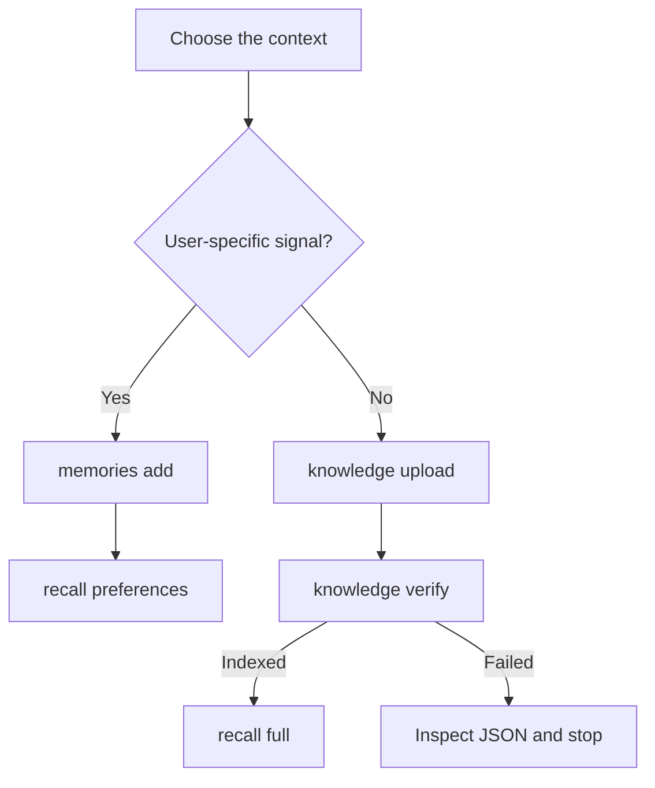

The HydraDB CLI lets you store memories, ingest knowledge, recall context, and inspect
sources without writing an SDK integration. This guide takes you from the first command
to a script that handles asynchronous indexing and response-level failures.

<Note>
  The CLI currently uses the legacy terms **tenant** and **sub-tenant**. They map to
  **database** and **collection** in the current API. Use the same tenant/database and
  sub-tenant/collection values when moving between the CLI, SDKs, and raw API. See
  [Databases and collections](/essentials/v2/multi-tenant).
</Note>

## The complete journey



The important difference is the indexing boundary: memory commands can be recalled as
memories, while uploaded knowledge must finish asynchronous processing before recall.

## Quick start

<Steps>
  <Step title="Install the CLI">
    <Tabs>
      <Tab title="Installer">
        ```bash
        curl -fsSL https://cli.hydradb.com/install | bash
        ```
      </Tab>
      <Tab title="pip">
        ```bash
        python -m pip install hydradb-cli
        ```
      </Tab>
    </Tabs>

    Python 3.10 or later is required. Confirm the executable is available:

    ```bash
    hydradb --version
    ```
  </Step>

  <Step title="Authenticate and set a default tenant">
    ```bash
    hydradb login --tenant-id my-database
    ```

    The interactive prompt reads the API key without displaying it. The CLI saves the
    key and tenant to `~/.hydradb/config.json` with file mode `0600`.

    <Tip>
      Passing only `hydradb login` prompts for the API key, but does not prompt for a
      tenant. Add `--tenant-id`, or set it later with
      `hydradb config set tenant_id my-database`.
    </Tip>
  </Step>

  <Step title="Verify the resolved configuration">
    ```bash
    hydradb whoami
    ```

    The API key is masked. Check that the tenant and optional sub-tenant match the scope
    you plan to use for both ingestion and recall.
  </Step>

  <Step title="Store and recall a memory">
    ```bash
    hydradb memories add \
      --text "Alex prefers concise technical answers" \
      --source-id alex_preferences \
      --user-name Alex

    hydradb recall preferences "How should I answer Alex?"
    ```
  </Step>
</Steps>

## Choose Memory or Knowledge

Route data according to who it belongs to and how it should be recalled.

| Input | CLI command | Recall command | Why |
|---|---|---|---|
| User preference, behavior, or conversation signal | `hydradb memories add` | `hydradb recall preferences` | Personalized context that follows a user or workspace |
| Already-written memory that should be preserved verbatim | `hydradb memories add --no-infer` | `hydradb recall preferences` | Skips inference over content you have already normalized |
| Shared PDF, Markdown, DOCX, or text file | `hydradb knowledge upload` | `hydradb recall full` | Reusable organizational or product knowledge |
| Shared inline text | `hydradb knowledge upload-text` | `hydradb recall full` | Knowledge that does not need a file wrapper |
| Exact word or phrase lookup | Ingest as Memory or Knowledge | `hydradb recall keyword` | Deterministic text matching instead of semantic recall |

### Decide whether to infer

`memories add` uses `--infer` by default.

- Keep `--infer` for raw conversations, observations, or notes from which HydraDB should
  extract durable facts and preferences.
- Use `--no-infer` when the text is already the exact memory you want to store.

```bash
# Raw signal: extract durable preferences
hydradb memories add \
  --text "Alex asked for dark mode again and wants weekly summaries" \
  --source-id onboarding_chat \
  --infer

# Already normalized: store the statement as written
hydradb memories add \
  --text "Preferred theme: dark" \
  --source-id preferred_theme \
  --no-infer
```

### Make reruns intentional

| Command | Rerun control |
|---|---|
| `memories add` | Supply a stable `--source-id`. Upsert is enabled by default; use `--no-upsert` when replacement is not allowed. |
| `knowledge upload` | Use `--upsert` when the server should update matching sources. |
| `knowledge upload-text` | Supply a stable `--source-id`. Check `hydradb knowledge upload-text --help` for the upsert controls available in your installed version. |

<Warning>
  An automatically generated source ID makes each run a new source. For repeatable jobs,
  choose a stable ID derived from the record's real identity, not from its latest text.
</Warning>

## Configuration

The CLI resolves environment variables before values in `~/.hydradb/config.json`.

| Variable | Purpose | Default |
|---|---|---|
| `HYDRA_DB_API_KEY` | HydraDB API key | Required |
| `HYDRA_DB_TENANT_ID` | Default tenant/database | Required for data commands unless `--tenant-id` is passed |
| `HYDRA_DB_SUB_TENANT_ID` | Default sub-tenant/collection | None |
| `HYDRA_DB_BASE_URL` | API base URL | `https://api.hydradb.com` |
| `HYDRADB_OUTPUT` | `human` or `json` output | `human` |

<Tabs>
  <Tab title="macOS/Linux">
    ```bash
    export HYDRA_DB_API_KEY="your-api-key"
    export HYDRA_DB_TENANT_ID="my-database"
    export HYDRA_DB_SUB_TENANT_ID="user-alex"
    ```
  </Tab>
  <Tab title="Windows PowerShell">
    ```powershell
    $env:HYDRA_DB_API_KEY = "your-api-key"
    $env:HYDRA_DB_TENANT_ID = "my-database"
    $env:HYDRA_DB_SUB_TENANT_ID = "user-alex"
    ```
  </Tab>
</Tabs>

Use the config file for interactive development:

```bash
hydradb config set tenant_id my-database
hydradb config set sub_tenant_id user-alex
hydradb config set base_url https://api.hydradb.com
hydradb config show
```

The supported persisted keys are `api_key`, `tenant_id`, `sub_tenant_id`, and
`base_url`. Output is a global option, not a persisted config key. Set it with
`HYDRADB_OUTPUT=json` or place the option before the command group:

```bash
hydradb -o json memories list
```

<Warning>
  `hydradb memories list --output json` is not equivalent. Global options such as
  `--output` must appear before `memories`, `knowledge`, `recall`, or `fetch`.
</Warning>

## Ingest Knowledge, verify it, then recall it

Knowledge ingestion is asynchronous. A successful upload means the API accepted the
request; it does not mean the content is searchable yet.

<Steps>
  <Step title="Upload with JSON output">
    ```bash
    upload_json="$(hydradb -o json knowledge upload ./runbook.md)"
    printf '%s\n' "$upload_json" | jq .
    ```

    Extract the returned source ID while accepting either response field used by
    supported deployments:

    ```bash
    source_id="$(
      printf '%s\n' "$upload_json" |
        jq -r 'first(.results[]? | .source_id // .id) // empty'
    )"

    test -n "$source_id" || {
      printf '%s\n' "Upload did not return a source ID" >&2
      exit 1
    }
    ```
  </Step>

  <Step title="Validate response-level failures">
    A server can accept the HTTP request while reporting failed items in the JSON body.
    Validate both the process exit code and the response:

    ```bash
    printf '%s\n' "$upload_json" | jq -e '
      (type == "object") and
      ((.success // true) != false) and
      ((.failed_count // 0) == 0) and
      all(.results[]?;
        ((.status // "") | ascii_downcase) as $status |
        ($status != "failed" and $status != "error" and $status != "errored") and
        (.error? == null or .error == "")
      )
    ' >/dev/null || {
      printf '%s\n' "$upload_json" | jq . >&2
      exit 1
    }
    ```

    <Note>
      Do not rely on `$?` alone for response-level partial failures. CLI validation,
      network, and HTTP errors return non-zero, but behavior for a `2xx` response that
      contains failed items can vary by CLI version. Body validation keeps the script
      correct across those versions.
    </Note>
  </Step>

  <Step title="Poll until indexing is terminal">
    `knowledge verify` performs one status check. Put it in a bounded loop for
    automation:

    ```bash
    ready=false

    for attempt in $(seq 1 60); do
      status_json="$(hydradb -o json knowledge verify "$source_id")"
      status="$(
        printf '%s\n' "$status_json" |
          jq -r '(.statuses // .results // [])[0]
            | .indexing_status // .status // "unknown"'
      )"

      case "$status" in
        indexed|completed|graph_creation)
          ready=true
          break
          ;;
        failed|errored|error)
          printf '%s\n' "$status_json" | jq . >&2
          exit 1
          ;;
        *)
          sleep 2
          ;;
      esac
    done

    "$ready" || {
      printf '%s\n' "Timed out waiting for $source_id" >&2
      exit 1
    }
    ```

    `graph_creation` is searchable while graph construction continues. Wait for
    `completed` instead if your workflow requires the finished graph.
  </Step>

  <Step title="Recall the indexed knowledge">
    ```bash
    hydradb -o json recall full \
      "How do we rotate credentials?" \
      --mode thinking \
      --max-results 5 |
      jq '.chunks'
    ```
  </Step>
</Steps>

## A reusable CI script

This example combines the safeguards into one Bash workflow. It requires `jq` and uses
environment variables so no API key is written to disk.

```bash
#!/usr/bin/env bash
set -euo pipefail

: "${HYDRA_DB_API_KEY:?Set HYDRA_DB_API_KEY}"
: "${HYDRA_DB_TENANT_ID:?Set HYDRA_DB_TENANT_ID}"

upload_json="$(hydradb -o json knowledge upload ./runbook.md --upsert)"

printf '%s\n' "$upload_json" | jq -e '
  (type == "object") and
  ((.success // true) != false) and
  ((.failed_count // 0) == 0) and
  all(.results[]?;
    ((.status // "") | ascii_downcase) as $status |
    ($status != "failed" and $status != "error" and $status != "errored") and
    (.error? == null or .error == "")
  )
' >/dev/null

source_id="$(
  printf '%s\n' "$upload_json" |
    jq -er 'first(.results[]? | .source_id // .id)'
)"

for attempt in $(seq 1 60); do
  status_json="$(hydradb -o json knowledge verify "$source_id")"
  status="$(
    printf '%s\n' "$status_json" |
      jq -r '(.statuses // .results // [])[0]
        | .indexing_status // .status // "unknown"'
  )"

  case "$status" in
    indexed|completed|graph_creation) break ;;
    failed|errored|error)
      printf '%s\n' "$status_json" | jq . >&2
      exit 1
      ;;
    *)
      if [ "$attempt" -eq 60 ]; then
        printf '%s\n' "Indexing timed out for $source_id" >&2
        exit 1
      fi
      sleep 2
      ;;
  esac
done

hydradb -o json recall full "credential rotation" --max-results 5 |
  jq -e '.chunks | type == "array"'
```

## Command map

The default tenant comes from `hydradb login`, `hydradb config`, or
`HYDRA_DB_TENANT_ID`. Pass `--tenant-id` to a data command only when overriding it.

### Authentication and configuration

| Command | Purpose |
|---|---|
| `hydradb login --tenant-id TENANT_ID` | Prompt for an API key and save credentials |
| `hydradb logout` | Delete the saved config file |
| `hydradb whoami` | Show resolved, masked authentication and scope |
| `hydradb config show` | Show resolved configuration and value sources |
| `hydradb config set KEY VALUE` | Persist `api_key`, `tenant_id`, `sub_tenant_id`, or `base_url` |

### Memories

| Command | Purpose |
|---|---|
| `hydradb memories add --text TEXT` | Add a memory; also accepts piped stdin |
| `hydradb memories list` | List memories in the resolved scope |
| `hydradb memories delete MEMORY_ID` | Delete one memory; add `--yes` to skip confirmation |

```bash
printf '%s\n' "User prefers dark mode" | hydradb memories add
hydradb memories list
hydradb memories delete mem_abc123 --yes
```

### Knowledge

| Command | Purpose |
|---|---|
| `hydradb knowledge upload FILES...` | Upload one or more files asynchronously |
| `hydradb knowledge upload-text --text TEXT` | Upload inline text as shared knowledge |
| `hydradb knowledge verify SOURCE_IDS...` | Check processing status once |
| `hydradb knowledge delete SOURCE_IDS...` | Delete sources; add `--yes` to skip confirmation |

```bash
hydradb knowledge upload ./architecture.md ./runbook.pdf
hydradb knowledge upload-text \
  --text "Production deploys require two approvals" \
  --title "Deployment policy" \
  --source-id deployment_policy
hydradb knowledge verify source_abc123 source_def456
```

### Recall

| Command | Purpose |
|---|---|
| `hydradb recall full QUERY` | Semantic search over knowledge |
| `hydradb recall preferences QUERY` | Semantic search over memories |
| `hydradb recall keyword QUERY` | Exact/boolean search over sources or memories |

```bash
hydradb recall full "How is authentication implemented?" --mode thinking
hydradb recall preferences "What IDE does the user prefer?"
hydradb recall keyword "PostgreSQL migration" --operator phrase --search-mode sources
```

### Inspect data

| Command | Purpose |
|---|---|
| `hydradb fetch sources` | List source IDs; filter with `--kind knowledge` or `--kind memories` |
| `hydradb fetch content SOURCE_ID` | Return content, a presigned URL, or both |
| `hydradb fetch relations SOURCE_ID` | Show extracted graph relations |

```bash
hydradb fetch sources --kind knowledge --page-size 20
hydradb fetch content source_abc123 --mode both
hydradb fetch relations source_abc123 --is-knowledge
```

### Tenant management

| Command | Purpose |
|---|---|
| `hydradb tenant create TENANT_ID` | Create a tenant/database |
| `hydradb tenant monitor [TENANT_ID]` | Show infrastructure status and statistics |
| `hydradb tenant list-sub-tenants [TENANT_ID]` | List sub-tenants/collections |
| `hydradb tenant delete TENANT_ID` | Permanently delete the tenant and its data |

<Warning>
  `hydradb tenant delete` permanently removes the tenant, its memories, knowledge,
  and graph data. The operation cannot be undone.
</Warning>

## Troubleshooting

| Symptom | Cause | Fix |
|---|---|---|
| `No tenant ID specified` | No default or command override | Run `hydradb config set tenant_id TENANT_ID`, set `HYDRA_DB_TENANT_ID`, or pass `--tenant-id` |
| `No such option: --output` | Global option placed after a command group | Use `hydradb -o json ...` or set `HYDRADB_OUTPUT=json` |
| A documented positional text argument is rejected | Text is an option for add/upload-text | Use `--text "..."` or pipe stdin |
| Upload succeeds but recall is empty | Indexing is still asynchronous | Extract the returned ID and poll `hydradb knowledge verify` |
| Memory recall is empty | Ingestion and recall used different sub-tenants | Use the same sub-tenant/collection on both commands |
| Script exits `0` but items failed | Failure was reported inside a successful HTTP response | Use JSON mode and validate `failed_count`, item statuses, and item errors |
| Rerun creates another source | The job used an automatically generated ID | Supply a stable `--source-id` where supported and choose the intended upsert behavior |

## Source and support

<Card
  title="hydradb-cli"
  icon="github"
  href="https://github.com/usecortex/hydradb-cli"
>
  Read the source, inspect release notes, or report a CLI issue.
</Card>
