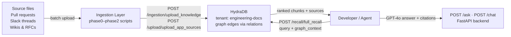

> **Cookbook 01** · Production-grade · Developer Tools

This guide walks you through building a **codebase AI assistant with full institutional memory** powered by HydraDB. Unlike a static docs search or naive RAG pipeline, this assistant continuously indexes your code, pull requests, Slack decisions, and RFCs — and answers both factual questions ("What does this function do?") and reasoning questions ("Why was this built this way?") with full cited context across all four source types.

> **Note**: All code in this guide uses real HydraDB endpoints. Base URL: `https://api.hydradb.com`. Get your API key at [hydradb.com](https://hydradb.com) or email founders@hydradb.com.

> **Goal**: Build a FastAPI backend with `POST /ask` (sync JSON, easier for Postman) and `POST /chat` (streaming NDJSON for frontends) that retrieves ranked chunks from HydraDB and generates grounded GPT-4o answers. Full recall round-trip under 200ms.

---

## Why Standard RAG Fails for Codebases

Most RAG pipelines index source files and call it done. Ask "what does this function do?" and they work fine. Ask "why was this built this way?" and they fail — because the rationale almost never lives in the code file itself. It lives in the PR that introduced the change, the Slack thread where the decision was debated, and the RFC that documented the outcome.

HydraDB fixes this with two capabilities standard vector search cannot replicate:

1. **Context graph** — set `relations.hydradb_source_ids` on ingestion to create explicit edges between a source file, the PR that changed it, the Slack thread that approved it, and the RFC that motivated it. When you query, HydraDB traverses these edges automatically. Set `graph_context: true` to enable multi-hop retrieval.
2. **Sub-tenant isolation** — each repo or team gets its own `sub_tenant_id`. Query one repo in isolation or search across all of them in a single call by omitting `sub_tenant_id`.

---

## Architecture Overview



- **Phase 0**: Create tenant, upload one file, verify indexing, run first recall query.
- **Phase 1**: Batch upload a full repo with structured IDs and metadata.
- **Phase 2**: Add PRs, Slack threads, and RFCs with explicit graph relations.
- **Phase 3**: FastAPI backend — `full_recall()` retrieves chunks, GPT-4o generates grounded answers.

---

## Phase 0 — Minimal Working System
*5–10 minutes · Goal: run one recall query and see actual results*

> Do Phase 0 first, even if you plan to skip ahead. Every later phase assumes the tenant exists and indexing works. Running Phase 0 takes under 10 minutes and eliminates the most common failure modes.

### Prerequisites

1. **A HydraDB API key** — starts with `hdb_`.
2. **Python 3.10+** — run `python3 --version` to check.
3. **Dependencies** — run `pip install requests python-dotenv`.

```bash
mkdir cursor-for-docs && cd cursor-for-docs
echo "HYDRADB_API_KEY=hdb_your_key_here" > .env
```

Create `config.py` in the project root — this is the canonical configuration used by every script in this guide:

```python
# config.py
import os
from dotenv import load_dotenv

load_dotenv()

# HydraDB
HYDRA_API_KEY = os.environ["HYDRADB_API_KEY"]
TENANT_ID     = os.environ.get("HYDRADB_TENANT_ID", "engineering-docs")
BASE_URL      = "https://api.hydradb.com"

HEADERS = {
    "Authorization": f"Bearer {HYDRA_API_KEY}",  # exact format: Bearer + space + key
    "Content-Type":  "application/json",
}

# OpenAI (or Groq — see Phase 3)
OPENAI_API_KEY = os.environ.get("OPENAI_API_KEY", "")
OPENAI_MODEL   = "gpt-4o"

# Recall defaults
RECALL_MAX_RESULTS = 15
RECALL_MIN_SCORE   = 0.5
RECALL_ALPHA       = 0.75
```

> `Authorization: Bearer hdb_abc123` — capital B, one space, no quotes. Anything else returns 401.

---

### Step 1 — Create a Tenant

Registers your top-level namespace. Tenant creation is **asynchronous** — do not upload files until polling confirms it is ready.

```python
# phase0/create_tenant.py
import sys, os, time, requests
sys.path.insert(0, os.path.dirname(os.path.dirname(__file__)))
from config import BASE_URL, TENANT_ID, HEADERS

def create_tenant():
    resp = requests.post(f"{BASE_URL}/tenants/create",
                         headers=HEADERS, json={"tenant_id": TENANT_ID})
    resp.raise_for_status()
    print(f"Accepted: {resp.json()}")
    _poll_until_ready()

def _poll_until_ready(timeout=180, interval=4):
    print("Polling for readiness...")
    deadline = time.time() + timeout
    while time.time() < deadline:
        r = requests.get(
            f"{BASE_URL}/tenants/infra_status",   # note: underscore, not /infra/status
            headers=HEADERS,
            params={"tenant_id": TENANT_ID},
            timeout=10,
        )
        if r.ok:
            status = r.json().get("status", "")
            if   status == "ready":  print("✓ Tenant ready."); return
            elif status == "failed": raise RuntimeError(f"Provisioning failed: {r.json()}")
            print(f"  status={status} — retrying in {interval}s")
        time.sleep(interval)
    raise TimeoutError("Tenant not ready within 180s")

if __name__ == "__main__": create_tenant()
```

```bash
python3 phase0/create_tenant.py
```

**Expected output:**
```
Accepted: {'tenant_id': 'engineering-docs', 'status': 'accepted', 'message': 'Tenant accepted. Poll /tenants/infra_status for readiness.'}
Polling for readiness...
  status=provisioning — retrying in 4s
✓ Tenant ready.
```

**If it fails:** `401` — API key wrong or missing `Bearer ` prefix.

---

### Step 2 — Upload One File

Uses multipart form-data to `/ingestion/upload_knowledge`. HydraDB handles chunking, embedding, and graph-node creation automatically.

> **Two ingestion modes exist.** This step uses multipart file upload — the tested beginner path. An advanced JSON body mode (Phases 1–2) supports structured IDs and explicit graph `relations`. Use file upload here first.

> **Do not set `Content-Type: application/json`** on upload requests. This is multipart. Let your HTTP client set the boundary automatically.

```bash
mkdir -p phase0/sample_docs
cat > phase0/sample_docs/auth_middleware.md << 'EOF'
# Auth Middleware — Internal IP Exception

## Decision
Token validation is skipped for requests from internal IP ranges
(10.0.0.0/8 and 172.16.0.0/12).

## Rationale
Service-to-service calls within the VPC caused circular dependency issues
during startup. The security team approved this in RFC-007, on the condition
that internal network access is controlled at the VPC level.

## Approved by
Security team — Slack #eng-architecture — 2024-02-14
EOF
```

```python
# phase0/upload_file.py
import sys, os, requests
sys.path.insert(0, os.path.dirname(os.path.dirname(__file__)))
from config import BASE_URL, TENANT_ID, HEADERS

def upload_file(filepath: str):
    # Strip Content-Type — requests sets the multipart boundary automatically
    upload_headers = {k: v for k, v in HEADERS.items() if k != "Content-Type"}
    filename = os.path.basename(filepath)
    with open(filepath, "rb") as f:
        resp = requests.post(
            f"{BASE_URL}/ingestion/upload_knowledge",
            headers=upload_headers,
            files={"files": (filename, f, "text/markdown")},  # field name is "files"
            data={"tenant_id": TENANT_ID},                    # tenant_id as form field
            timeout=60,
        )
    print("STATUS CODE:", resp.status_code)
    print("RESPONSE:", resp.text)
    resp.raise_for_status()
    return resp.json()

if __name__ == "__main__":
    result = upload_file("phase0/sample_docs/auth_middleware.md")
    print("\nCopy your source_id for use in verify.py:", result)
```

**Expected response:**
```json
{
  "results": [
    {
      "source_id": "YOUR_FILE_ID_HERE",
      "filename":  "auth_middleware.md",
      "status":    "accepted",
      "error":     null
    }
  ]
}
```

Save the `source_id` from `results[0].source_id` — you need it for Step 3.

**If it fails:**
- `404 Tenant does not exist` — Step 1 not complete, or `tenant_id` mismatch.
- `400 / missing files` — Confirm field name is `files` (not `file`). Do NOT set `Content-Type` manually.

---

### Step 3 — Verify Indexing

Poll `POST /ingestion/verify_processing` until `indexing_status` is `completed`. HydraDB indexes asynchronously — typically 10–30 seconds per file. Querying before this completes returns empty results with no error — the most common beginner confusion.

> **Note**: `verify_processing` uses POST with `file_ids` and `tenant_id` as URL query parameters, not in the request body.

```python
# phase0/verify.py
import sys, os, time, requests
sys.path.insert(0, os.path.dirname(os.path.dirname(__file__)))
from config import BASE_URL, TENANT_ID, HEADERS

FILE_ID = "YOUR_FILE_ID_HERE"  # replace with source_id from Step 2

def verify_file(file_id: str, timeout: int = 120, interval: int = 3):
    """
    Polls verify_processing until indexing_status is "completed" or "errored".
    HydraDB returns a "statuses" array — read statuses[0].indexing_status.
    sub_tenant_id is NOT required for this working flow.
    """
    print(f"Verifying '{file_id}'...")
    deadline = time.time() + timeout
    while time.time() < deadline:
        resp = requests.post(
            f"{BASE_URL}/ingestion/verify_processing",
            headers=HEADERS,
            params={"file_ids": file_id, "tenant_id": TENANT_ID},
            timeout=30,
        )
        try:
            statuses = resp.json().get("statuses", [])
            if statuses:
                status = statuses[0].get("indexing_status")
                if   status == "completed": print(f"✓ '{file_id}' ready."); return
                elif status == "errored":   raise RuntimeError(f"Indexing failed: {file_id}")
                print(f"  indexing_status: {status} — waiting...")
        except Exception: pass
        time.sleep(interval)
    raise TimeoutError("Indexing timed out")

if __name__ == "__main__":
    verify_file(FILE_ID)
```

---

### Step 4 — Run Your First Recall Query

`POST /recall/full_recall` returns a `chunks` array. Read `chunk_content` from each item — that is the text you pass to your LLM as context.

```bash
curl -X POST 'https://api.hydradb.com/recall/full_recall' \
  -H "Authorization: Bearer YOUR_API_KEY" \
  -H "Content-Type: application/json" \
  -d '{
    "tenant_id":   "engineering-docs",
    "query":       "internal IP auth skip logic",
    "max_results": 10
  }'
```

> `sub_tenant_id` is NOT required. HydraDB handles scope internally when omitted.
> Always iterate `chunks[]` and read `chunk_content` from each item — never use a `results` key.

```python
# phase0/recall.py
import sys, os, requests
sys.path.insert(0, os.path.dirname(os.path.dirname(__file__)))
from config import BASE_URL, TENANT_ID, HEADERS

def recall(query: str, max_results: int = 10) -> dict:
    resp = requests.post(
        f"{BASE_URL}/recall/full_recall",
        headers=HEADERS,
        json={"tenant_id": TENANT_ID, "query": query, "max_results": max_results},
        timeout=30,
    )
    resp.raise_for_status()
    return resp.json()

if __name__ == "__main__":
    data    = recall("internal IP auth skip logic")
    chunks  = data.get("chunks", [])
    sources = data.get("sources", [])
    print(f"\nChunks returned: {len(chunks)}")
    for i, chunk in enumerate(chunks, 1):
        print(f"\n[{i}] relevancy_score={chunk.get('relevancy_score','?')}")
        print(f"     {chunk.get('chunk_content','')[:300]}")
    print(f"\nSources: {[s.get('title') for s in sources]}")
```

**Expected output:**
```
Chunks returned: 2

[1] relevancy_score=0.94
     Token validation is skipped for requests from internal IP ranges...

[2] relevancy_score=0.87
     The security team approved this exception in RFC-007...

Sources: ['auth_middleware.md']
```

If `chunks: []` — re-run `verify.py` and confirm `indexing_status: completed`.

> Phase 0 complete. The same `/recall/full_recall` endpoint with the same minimal three-field body is used in every later phase. You'll only add parameters, not change the structure.

---

## Phase 1 — Improve Retrieval
*15–20 minutes · Goal: 50+ files indexed with metadata and scoped recall working*

### How Retrieval Works

When HydraDB indexes a document it splits content into overlapping **chunks**, each embedded independently. A `/recall/full_recall` response contains two arrays:

- `chunks[]` — iterate this; read `chunk_content` from each item for LLM context.
- `sources[]` — deduplicated source list; use for citation labels only.

**chunk_content is the only required field.** All others are optional:

| Field | Description |
|---|---|
| `chunk_content` | **Required.** The text of this chunk. Pass directly to your LLM. |
| `relevancy_score` | Ranked relevance for your query. Use to filter low-quality chunks. |
| `title` | Human-readable label. Use for `[Source: ...]` citations. |
| `chunk_uuid` | Unique chunk ID. Use for deduplication across sub-tenants. |
| `url` | URL set at ingestion time. Use for deep-links in citation UI. |
| `meta` | Metadata from ingestion — `doc_type`, `repo`, `pr_number`, etc. |

**relevancy_score thresholds:**

| Range | Meaning | Action |
|---|---|---|
| `0.85+` | High confidence — chunk directly answers the query | Always include |
| `0.65–0.85` | Good match | Include |
| `0.40–0.65` | Weak match — tangentially related | Include only if few high-score results |
| `below 0.40` | Low match | Drop to reduce noise |

Adding `"graph_context": true` to your recall request makes HydraDB walk explicit `relations.hydradb_source_ids` edges for every high-scoring chunk — enabling multi-hop "why" answers. Safe to add even with a single file and no relations.

---

### Step 1 — Batch Upload with Explicit IDs

Switches to JSON body ingestion via `/upload/upload_app_sources`. Gives full control over IDs, timestamps, collections, metadata, and (in Phase 2) explicit graph `relations`.

> **Advanced path — stricter validation.** Every item requires `id`, `type`, and `content.text`. Use file upload (Phase 0) if you just need content indexed quickly. Use JSON ingestion when you need stable IDs and graph relations.

> **Batch limit**: Max 20 items per request. Sleep 1 second between batches.

```python
# phase1/batch_upload.py
import sys, os, time, subprocess, pathlib, requests
sys.path.insert(0, os.path.dirname(os.path.dirname(__file__)))
from config import BASE_URL, TENANT_ID, HEADERS
from phase0.verify import verify_file

TEXT_EXTS = {".py",".ts",".js",".go",".rs",".java",".md",".yaml",".toml",".txt"}
SKIP_DIRS = {".git","node_modules","dist","build","__pycache__",".venv"}

def git_timestamp(repo_path: str, rel_path: str) -> str:
    try:
        raw = subprocess.check_output(
            ["git","log","-1","--format=%cI",rel_path],
            cwd=repo_path, stderr=subprocess.DEVNULL).decode().strip()
        return raw or "2020-01-01T00:00:00Z"
    except: return "2020-01-01T00:00:00Z"

def upload_batch(batch: list) -> list:
    resp = requests.post(
        f"{BASE_URL}/upload/upload_app_sources",
        headers=HEADERS, params={"tenant_id": TENANT_ID},
        json=batch, timeout=30,
    )
    resp.raise_for_status()
    ids = resp.json().get("ids", [])
    print(f"  Uploaded {len(ids)} items")
    return ids

def verify_batch(ids: list):
    for fid in ids: verify_file(fid)

def ingest_directory(repo_path: str, repo_name: str) -> list:
    batch, all_ids = [], []
    root = pathlib.Path(repo_path).resolve()
    for f in root.rglob("*"):
        if f.is_dir() or any(p in f.parts for p in SKIP_DIRS): continue
        if f.suffix not in TEXT_EXTS or f.stat().st_size > 500_000: continue
        rel = str(f.relative_to(root))
        try: content = f.read_text(encoding="utf-8", errors="ignore")
        except: continue
        batch.append({
            "id":          f"{repo_name}/{rel}",   # Phase 2 PR relations reference this ID exactly
            "title":       rel,
            "type":        "document",
            "timestamp":   git_timestamp(str(root), rel),
            "content":     {"text": content},
            "collections": ["codebase", repo_name, f.suffix.lstrip(".")],
            "meta": {"doc_type":"source_file","repo":repo_name,
                     "language":f.suffix.lstrip("."),"tags":["codebase",repo_name]},
        })
        if len(batch) == 20:
            all_ids += upload_batch(batch); batch = []; time.sleep(1)
    if batch: all_ids += upload_batch(batch)
    print(f"Verifying {len(all_ids)} files...")
    verify_batch(all_ids)
    print(f"✓ {len(all_ids)} files indexed from '{repo_name}'")
    return all_ids

if __name__ == "__main__":
    ingest_directory("/path/to/your/repo", "myrepo")
```

---

### Step 2 — Metadata and Collections

`collections` are labels for scoping recall. `meta` fields are arbitrary key-value pairs for filtering and citation labels. Both go in the ingestion payload — no extra API calls needed.

```json
{
  "collections": ["codebase", "myrepo", "py"],
  "meta": {
    "doc_type": "source_file",
    "repo":     "myrepo",
    "language": "py",
    "tags":     ["codebase", "auth"]
  }
}
```

Recommended `doc_type` values: `source_file | pull_request | slack_thread | rfc | adr | wiki | runbook`

---

### Step 3 — Tuned Recall with Graph Context

```python
# phase1/tuned_recall.py
import sys, os, requests
sys.path.insert(0, os.path.dirname(os.path.dirname(__file__)))
from config import BASE_URL, TENANT_ID, HEADERS

def tuned_recall(query: str, scope: str = None, max_results: int = 15) -> dict:
    body = {
        "tenant_id":     TENANT_ID,
        "query":         query,
        "max_results":   max_results,
        "mode":          "thinking",   # deeper semantic ranking
        "graph_context": True,         # walk edges to linked PRs, wikis, Slack
        "alpha":         0.75,         # 0=keyword, 1=semantic
        "recency_bias":  0.2,
    }
    if scope: body["sub_tenant_id"] = scope
    resp = requests.post(f"{BASE_URL}/recall/full_recall",
                         headers=HEADERS, json=body, timeout=20)
    resp.raise_for_status()
    return resp.json()
```

---

## Phase 2 — Multi-source Context
*20–30 minutes · Goal: a "why" question returns code + PR + Slack + RFC in one response*

Connect GitHub source files to pull requests, Slack decision threads, and internal wikis using explicit `relations.hydradb_source_ids` to guarantee graph edges.

> Setting `relations.hydradb_source_ids` **guarantees** a graph link every time. Always use explicit relations for links that matter.

### Why Each Source Type Matters

| Source | Answers | Without it |
|---|---|---|
| Source files | *What* the code does | No traversal starting point |
| Pull requests | *Why* the change happened — intent, debate, alternatives | Code exists but has no rationale |
| Slack threads | Informal approvals and trade-offs | Informal decisions are invisible |
| Wikis & RFCs | Formal decision record and approval chain | Missing the authoritative "because" |

---

### Step 1 — Ingest GitHub Source Files

Use `ingest_directory()` from Phase 1 Step 1 with the `{repo_name}/{relative_path}` ID convention. PR ingestion references these IDs exactly in `relations.hydradb_source_ids` — they must match.

---

### Step 2 — Ingest Pull Requests with Graph Relations

```python
# phase2/ingest_prs.py
import sys, os, time, requests
sys.path.insert(0, os.path.dirname(os.path.dirname(__file__)))
from config import BASE_URL, TENANT_ID, HEADERS
from phase1.batch_upload import upload_batch, verify_batch

GH_TOKEN = os.environ.get("GITHUB_TOKEN", "")
GH_OWNER = os.environ.get("GITHUB_OWNER", "")
GH_REPO  = os.environ.get("GITHUB_REPO",  "")
GH_HEADS = {"Authorization": f"Bearer {GH_TOKEN}",
            "Accept": "application/vnd.github+json"}

def fetch_merged_prs(max_pages: int = 5) -> list:
    base, prs = f"https://api.github.com/repos/{GH_OWNER}/{GH_REPO}", []
    for page in range(1, max_pages+1):
        r = requests.get(f"{base}/pulls", headers=GH_HEADS,
            params={"state":"closed","per_page":100,"page":page}, timeout=15)
        r.raise_for_status()
        page_prs = [p for p in r.json() if p.get("merged_at")]
        if not page_prs: break
        for pr in page_prs:
            url = pr["url"]
            pr["files"]   = requests.get(f"{url}/files",    headers=GH_HEADS, timeout=10).json()
            pr["reviews"] = requests.get(f"{url}/reviews",  headers=GH_HEADS, timeout=10).json()
            pr["comments"]= requests.get(f"{url}/comments", headers=GH_HEADS, timeout=10).json()
            prs.append(pr); time.sleep(0.05)
    print(f"✓ Fetched {len(prs)} PRs")
    return prs

def ingest_pull_requests(prs: list, repo_name: str) -> list:
    batch, all_ids = [], []
    for pr in prs:
        if not pr.get("merged_at"): continue
        changed    = [f["filename"] for f in pr.get("files", [])]
        reviews    = "\n\n".join(r["body"] for r in pr.get("reviews",[])  if r.get("body"))
        comments   = "\n\n".join(c["body"] for c in pr.get("comments",[]) if c.get("body"))
        source_ids = [f"{repo_name}/{fname}" for fname in changed]  # must match ingest_directory IDs
        content    = (
            f"PR #{pr['number']}: {pr['title']}\n"
            f"Author: {pr['user']['login']} | Merged: {pr['merged_at']}\n\n"
            f"Description:\n{pr.get('body') or '(none)'}\n\n"
            f"Changed files:\n" + "\n".join(changed) +
            f"\n\nReview comments:\n{reviews or '(none)'}\n\n"
            f"Inline comments:\n{comments or '(none)'}"
        )
        batch.append({
            "id":          f"pr-{pr['number']}",
            "title":       f"PR #{pr['number']}: {pr['title']}",
            "type":        "document",
            "timestamp":   pr["merged_at"],
            "content":     {"text": content},
            "collections": ["pull-requests"],
            "relations":   {"hydradb_source_ids": source_ids},
            "meta": {"doc_type":"pull_request","pr_number":pr["number"],
                     "author":pr["user"]["login"],"changed_files":changed},
        })
        if len(batch)==20: all_ids+=upload_batch(batch); batch=[]; time.sleep(1)
    if batch: all_ids+=upload_batch(batch)
    verify_batch(all_ids)
    print(f"✓ {len(all_ids)} PRs indexed")
    return all_ids

if __name__ == "__main__":
    prs = fetch_merged_prs(max_pages=3)
    ingest_pull_requests(prs, "myrepo")
```

---

### Step 3 — Ingest Slack Threads

```python
# phase2/ingest_slack.py
import sys, os, json, time, pathlib
from datetime import datetime
sys.path.insert(0, os.path.dirname(os.path.dirname(__file__)))
from phase1.batch_upload import upload_batch, verify_batch

def ingest_slack_export(export_dir: str, channels: list[str]) -> list:
    """
    Ingests a Slack export ZIP (unzipped).
    Structure: {export_dir}/{channel_name}/{YYYY-MM-DD}.json
    """
    batch, all_ids = [], []
    root = pathlib.Path(export_dir)
    for channel in channels:
        channel_dir = root / channel
        if not channel_dir.is_dir(): continue
        all_messages = []
        for day_file in sorted(channel_dir.glob("*.json")):
            try: all_messages.extend(json.loads(day_file.read_text()))
            except: continue
        threads: dict[str, list] = {}
        for msg in all_messages:
            key = msg.get("thread_ts") or msg["ts"]
            threads.setdefault(key, []).append(msg)
        for thread_ts, msgs in threads.items():
            text = "\n".join(f"[{m.get('user','?')}]: {m.get('text','')}"
                             for m in msgs if m.get("text"))
            if not text.strip(): continue
            ts_dt = datetime.fromtimestamp(float(thread_ts)).isoformat() + "Z"
            batch.append({
                "id":          f"slack-{channel}-{thread_ts}",
                "title":       f"Slack — #{channel} — {ts_dt[:10]}",
                "type":        "document",
                "timestamp":   ts_dt,
                "content":     {"text": f"Channel: #{channel}\n\n{text}"},
                "collections": ["slack", channel],
                "meta": {"doc_type":"slack_thread","channel":channel,"message_count":len(msgs)},
            })
            if len(batch)==20: all_ids+=upload_batch(batch); batch=[]; time.sleep(1)
        print(f"  Processed #{channel}: {len(threads)} threads")
    if batch: all_ids+=upload_batch(batch)
    verify_batch(all_ids)
    print(f"✓ {len(all_ids)} Slack threads indexed")
    return all_ids

if __name__ == "__main__":
    ingest_slack_export("/path/to/unzipped-slack-export", ["eng-architecture","incidents"])
```

---

### Step 4 — Ingest Wikis & RFCs

```python
# phase2/ingest_wikis.py
import sys, os, time, pathlib
sys.path.insert(0, os.path.dirname(os.path.dirname(__file__)))
from phase1.batch_upload import upload_batch, verify_batch

def ingest_wikis(pages: list) -> list:
    """
    pages: list of dicts — each requires id, title, content, doc_type, last_updated.
    doc_type: "rfc" | "adr" | "wiki" | "runbook" | "postmortem"
    """
    batch, all_ids = [], []
    for page in pages:
        batch.append({
            "id":          f"wiki-{page['id']}",
            "title":       page["title"],
            "type":        "document",
            "timestamp":   page["last_updated"],
            "content":     {"text": page["content"]},
            "url":         page.get("url", ""),
            "collections": ["wikis", page["doc_type"]],
            "meta": {"doc_type":page["doc_type"],"author":page.get("author","")},
        })
        if len(batch)==20: all_ids+=upload_batch(batch); batch=[]; time.sleep(1)
    if batch: all_ids+=upload_batch(batch)
    verify_batch(all_ids)
    print(f"✓ {len(all_ids)} wiki/RFC pages indexed")
    return all_ids

def ingest_markdown_folder(folder: str) -> list:
    pages = []
    for f in pathlib.Path(folder).rglob("*.md"):
        pages.append({
            "id":           f.stem,
            "title":        f.stem.replace("-"," ").replace("_"," ").title(),
            "content":      f.read_text(encoding="utf-8",errors="ignore"),
            "doc_type":     "rfc" if "rfc" in f.name.lower() else "wiki",
            "last_updated": "2024-01-01T00:00:00Z",
        })
    return ingest_wikis(pages)
```

### Step 5 — Run a Multi-source Graph Query

```bash
curl -X POST 'https://api.hydradb.com/recall/full_recall' \
  -H "Authorization: Bearer YOUR_API_KEY" \
  -H "Content-Type: application/json" \
  -d '{
    "tenant_id":     "engineering-docs",
    "query":         "Why does the auth middleware skip token validation for internal IPs?",
    "mode":          "thinking",
    "max_results":   15,
    "alpha":         0.75,
    "recency_bias":  0.2,
    "graph_context": true
  }'
```

**Expected output after ingesting all four source types:**
```
The auth middleware skips token validation for internal IPs per RFC-007
[Source: wiki-rfc-007]. This was introduced in PR #142 [Source: pr-142]
to resolve circular dependency issues at startup. The security team
approved the exception in #eng-architecture [Source: Slack — 2024-02-14].
```

> Phase 2 complete. A "why" question now returns a multi-hop cited answer across code, PRs, Slack, and RFCs.

---

## Phase 3 — Backend & Answer Generation
*25–35 minutes · Goal: POST /chat and POST /ask → HydraDB chunks → GPT-4o → answer*

HydraDB is the **memory layer** — retrieves ranked chunks via `full_recall()`. GPT-4o is the **reasoning layer** — reads those chunks and writes a grounded, cited answer. The two layers are kept strictly separate so they fail independently and can be debugged in isolation.

**Data flow:**
```
POST /ask or /chat → recall_context() → build_context_block() → stream_answer() → response
```

### File Structure

```
backend/
├── __init__.py       — makes backend a package
├── config.py         — credentials and recall defaults
├── hydra_client.py   — full_recall() primary path; qna() marked advanced
├── recall.py         — recall_context() and build_context_block()
├── answer.py         — prompt formatter, GPT-4o streaming, anti-hallucination rules
└── app.py            — /chat (streaming) and /ask (sync JSON, easier for Postman)
```

```bash
pip install fastapi "uvicorn[standard]" openai python-dotenv requests
echo "OPENAI_API_KEY=sk-your-key-here" >> .env
mkdir -p backend && touch backend/__init__.py
```

---

### backend/config.py

```python
import os
from dotenv import load_dotenv
load_dotenv()

HYDRA_API_KEY      = os.environ["HYDRADB_API_KEY"]
TENANT_ID          = os.environ.get("HYDRADB_TENANT_ID", "engineering-docs")
BASE_URL           = "https://api.hydradb.com"
HEADERS            = {"Authorization": f"Bearer {HYDRA_API_KEY}",
                      "Content-Type": "application/json"}
OPENAI_API_KEY     = os.environ["OPENAI_API_KEY"]
OPENAI_MODEL       = "gpt-4o"
RECALL_MAX_RESULTS = 15
RECALL_MIN_SCORE   = 0.5
RECALL_ALPHA       = 0.75
```

---

### backend/hydra_client.py

`full_recall()` is the **primary verified path** — build and test on this first. `qna()` is advanced and not required for the first working backend.

```python
import uuid, requests
from backend.config import BASE_URL, TENANT_ID, HEADERS, RECALL_MAX_RESULTS, RECALL_ALPHA

def full_recall(query: str, max_results: int = RECALL_MAX_RESULTS,
                scope: str = None, graph_context: bool = True,
                recency_bias: float = 0.2) -> dict:
    """
    PRIMARY VERIFIED PATH — build and test your backend on this function first.
    Response:
      "chunks"  — iterate this array; read chunk_content from each item for LLM context.
      "sources" — deduplicated source list; use for citations.
    """
    body = {
        "tenant_id":     TENANT_ID,
        "query":         query,
        "max_results":   max_results,
        "mode":          "thinking",
        "graph_context": graph_context,
        "alpha":         RECALL_ALPHA,
        "recency_bias":  recency_bias,
    }
    if scope:
        body["sub_tenant_id"] = scope
    resp = requests.post(f"{BASE_URL}/recall/full_recall",
                         headers=HEADERS, json=body, timeout=30)
    resp.raise_for_status()
    return resp.json()

def qna(question: str, session_id: str = None, user_name: str = "dev") -> dict:
    """
    ADVANCED — not required for the first working backend.
    Build and verify the full_recall() path before switching to this.
    Adds debugging complexity and longer response time.
    """
    resp = requests.post(f"{BASE_URL}/search/qna", headers=HEADERS, json={
        "question": question, "session_id": session_id or str(uuid.uuid4()),
        "tenant_id": TENANT_ID, "user_name": user_name, "top_n": 15,
        "search_modes": ["creative"], "ai_generation": True,
        "multi_step_reasoning": True, "graph_context": True,
        "auto_agent_routing": True, "search_alpha": 0.65, "recency_bias": 0.15,
    }, timeout=60)
    resp.raise_for_status()
    return resp.json()
```

---

### backend/recall.py

```python
from backend.hydra_client import full_recall

def recall_context(query: str, max_results: int = 10) -> dict:
    """Returns raw HydraDB payload with 'chunks' and 'sources' keys."""
    return full_recall(query=query, max_results=max_results,
                       scope=None, graph_context=True, recency_bias=0.2)

def build_context_block(recall_payload: dict) -> str:
    """
    Extracts chunk_content from each chunk and assembles the LLM context string.
    Always iterate chunks[] — the correct key is "chunks", never "results".
    """
    chunks  = recall_payload.get("chunks", [])
    sources = recall_payload.get("sources", [])
    context_parts = [c.get("chunk_content","").strip()
                     for c in chunks if c.get("chunk_content","").strip()]
    source_lines  = [f"- {s.get('title','Untitled')} ({s.get('id','')})"
                     for s in sources]
    return (f"Context:\n{chr(10).join(context_parts)}"
            f"\n\nSources:\n{chr(10).join(source_lines)}")
```

> **Production upgrade**: add a `relevancy_score` filter (drop below `RECALL_MIN_SCORE`) and a ~12,000 character cap to `build_context_block` before going to production.

---

### backend/answer.py

```python
from typing import Generator
from openai import OpenAI
from backend.config import OPENAI_API_KEY, OPENAI_MODEL

_client = OpenAI(api_key=OPENAI_API_KEY)

SYSTEM_PROMPT = """You are a codebase AI assistant. Answer questions about
code, architecture decisions, pull requests, and engineering discussions.

RULES:
1. Only answer from the provided context.
2. If context is insufficient say: "I don't have enough context to answer that."
3. Cite sources inline using [Source: exact_title_here].
4. If multiple sources support a claim, cite all of them.
5. Distinguish between what the code does, why it was written that way,
   and who approved or discussed it.
6. Never speculate."""

def format_prompt(question: str, context: str) -> list[dict]:
    return [
        {"role": "system", "content": SYSTEM_PROMPT},
        {"role": "user", "content":
            f"CONTEXT FROM CODEBASE (retrieved by HydraDB):\n\n{context}\n\n"
            f"---\n\nQUESTION: {question}\n\n"
            "Answer using only the context above. Cite every source you use."},
    ]

def stream_answer(question: str, context: str) -> Generator[str, None, None]:
    """If context is empty, returns a safe fallback without calling the LLM."""
    if not context.strip():
        yield ("I couldn't find relevant context for that question. "
               "The index may still be building, or the topic may not be ingested yet.")
        return
    stream = _client.chat.completions.create(
        model=OPENAI_MODEL, messages=format_prompt(question, context),
        stream=True, max_tokens=1200,
        temperature=0.1,   # low temp = grounded, not creative
    )
    for chunk in stream:
        delta = chunk.choices[0].delta.content or ""
        if delta: yield delta
```

> Do not raise temperature above 0.2 for this use case. Higher temperature increases creativity — the opposite of what you want for accurate, cited answers about specific code.

> **Using Groq instead of OpenAI (free)?** Change the client initialisation in `answer.py`:
> ```python
> _client = OpenAI(api_key=os.environ["GROQ_API_KEY"],
>                  base_url="https://api.groq.com/openai/v1")
> OPENAI_MODEL = "llama3-8b-8192"
> ```

---

### backend/app.py

```python
import json
from fastapi import FastAPI, HTTPException
from fastapi.middleware.cors import CORSMiddleware
from fastapi.responses import StreamingResponse
from backend.recall import recall_context, build_context_block
from backend.answer import stream_answer

app = FastAPI(title="Cursor for Docs API")
app.add_middleware(CORSMiddleware, allow_origins=["*"],
                   allow_methods=["GET","POST"], allow_headers=["*"])

@app.get("/")
def health():
    return {"status": "ok"}

@app.post("/chat")
async def chat(body: dict):
    """Streaming NDJSON — best for frontends. Line 1: sources. Lines 2+: text tokens."""
    question = body.get("question", "").strip()
    if not question:
        raise HTTPException(400, "question is required")
    recall_payload = recall_context(question, max_results=10)
    context_block  = build_context_block(recall_payload)
    async def stream():
        yield json.dumps({"sources": recall_payload.get("sources", [])}) + "\n"
        for token in stream_answer(question, context_block):
            yield json.dumps({"text": token}) + "\n"
    return StreamingResponse(stream(), media_type="application/x-ndjson")

@app.post("/ask")
def ask(body: dict):
    """Sync JSON — easier for Postman testing and API consumers that don't stream."""
    question = body.get("question", "").strip()
    if not question:
        raise HTTPException(400, "question is required")
    recall_payload = recall_context(question, max_results=10)
    context_block  = build_context_block(recall_payload)
    return {
        "answer":        "".join(stream_answer(question, context_block)),
        "sources":       recall_payload.get("sources", []),
        "chunks":        recall_payload.get("chunks", []),
        "graph_context": recall_payload.get("graph_context", {}),
    }
```

### Running the Server

```bash
uvicorn backend.app:app --reload --port 8000
```

**Test `/ask` in Postman:**

```bash
curl -X POST http://localhost:8000/ask \
  -H "Content-Type: application/json" \
  -d '{"question": "Why does auth skip token validation for internal IPs?"}'
```

**Test `/chat` (streaming):**

```bash
curl -s -X POST http://localhost:8000/chat \
  -H "Content-Type: application/json" \
  -d '{"question": "Why does auth skip token validation for internal IPs?"}' \
  | python3 -c "
import sys, json
for line in sys.stdin:
    obj = json.loads(line)
    if 'sources' in obj: print('Sources:', [s.get('title') for s in obj['sources']])
    elif 'text' in obj:  print(obj['text'], end='', flush=True)
print()
"
```

> Phase 3 complete. HydraDB retrieves ranked chunks via `full_recall()`. GPT-4o reads them via `stream_answer()` and writes a grounded, cited answer.

**Debugging checklist if `/ask` returns Internal Server Error:**

1. Check uvicorn terminal for the traceback immediately after sending the request.
2. If `chunks: []` in the response — HydraDB recall failed, not the LLM. Re-run `verify.py`.
3. Run the HydraDB isolation test: `python -c "from backend.hydra_client import full_recall; print(full_recall('test'))"`
4. Run the LLM isolation test: `python -c "from backend.answer import stream_answer; [print(t,end='') for t in stream_answer('hello','some context')]"`
5. `KeyError: OPENAI_API_KEY` or `GROQ_API_KEY` — key missing from `.env`. Restart uvicorn after adding it.

---

## Phase 4 — Productization
*Coming next · Goal: team using it daily with a fresh index on every merge*

Upcoming: VS Code extension (TypeScript), webview chat UI, active-file context injection, daily cron sync, GitHub Actions on push to main, incremental re-index, recall quality monitoring.

**Good progression to follow:**
Phase 0 recall in terminal → FastAPI `/ask` in Postman → FastAPI `/chat` with a simple web frontend → VS Code sidebar → streaming, incremental sync, caching, usage analytics.

---

## Troubleshooting

| Error | Cause | Fix |
|---|---|---|
| `401` | `Bearer ` prefix missing or key has stray quotes in `.env` | No quotes around key. Run `python -c "from config import HYDRA_API_KEY; print(repr(HYDRA_API_KEY))"` |
| `404 Tenant does not exist` | Tenant not created or `tenant_id` mismatch (case-sensitive) | Run `create_tenant.py`, wait for "✓ Tenant ready." |
| `400 missing files` | Field name `file` instead of `files`, or `Content-Type` manually set | Use `files={"files": ...}`. Never set `Content-Type` on upload requests. |
| `chunks: []` | Indexing still in progress | Re-run `verify.py` — confirm `indexing_status: completed` before querying. |
| `429 insufficient_quota` | No OpenAI credits | Add billing at platform.openai.com, or switch to Groq (free) — see `answer.py` note above. |
| `KeyError: 'GROQ_API_KEY'` | Key not in `.env` | Add `GROQ_API_KEY=gsk_...` to `.env`. Restart uvicorn. |
| Internal Server Error | Check uvicorn terminal for traceback | Run isolation tests for HydraDB and LLM layers separately. |

> **General debugging pattern**: add `print("STATUS CODE:", resp.status_code)` and `print("RESPONSE:", resp.text[:500])` immediately after every `requests.post()` call.

---

## Production Notes

| Topic | Note |
|---|---|
| Batch size | Max 20 items per `/upload/upload_app_sources` request. Sleep 1s between batches. |
| Indexing delays | Always poll `verify_processing`. Never rely on a fixed sleep. |
| Upserts | HydraDB upserts by `id`. Re-uploading replaces existing documents. |
| Context window | Add `relevancy_score` filter and ~12,000 char cap to `build_context_block` for production. |
| Graph edge consistency | Ingest source files first, then PRs. Re-ingest PRs if you add new files later. |
| API key security | Never commit to git. Rotate immediately if exposed. |
| LLM costs | ~$2–4/day for a 50-engineer team at 200 questions/day. Use `gpt-4o-mini` for factual lookups. |
| Recall monitoring | Log `relevancy_score` per chunk. Falling median scores signal index dilution — re-ingest with better metadata. |
| Slow responses | Reduce `max_results` to 5, use `/chat` for streaming feel, or switch to `mixtral-8x7b-32768` on Groq. |

---

## API Reference

All endpoints used in this cookbook. Base URL: `https://api.hydradb.com` · Header: `Authorization: Bearer YOUR_API_KEY`

| Method | Endpoint | Purpose |
|---|---|---|
| `POST` | `/tenants/create` | Create the engineering-docs tenant |
| `GET` | `/tenants/infra_status?tenant_id=...` | Poll until tenant is ready |
| `POST` | `/ingestion/upload_knowledge` | Upload a file (multipart form-data) |
| `POST` | `/ingestion/verify_processing?tenant_id=...&file_ids=...` | Check indexing status |
| `POST` | `/upload/upload_app_sources?tenant_id=...` | Batch JSON ingestion (advanced) |
| `POST` | `/recall/full_recall` | Query indexed content |
| `POST` | `/search/qna` | Multi-hop Q&A (advanced) |

### POST /tenants/create
```json
{ "tenant_id": "engineering-docs" }
```
Response: `{"tenant_id": "engineering-docs", "status": "accepted", "message": "Poll /tenants/infra_status for readiness."}`

### POST /ingestion/upload_knowledge
Multipart form-data. Do not set `Content-Type: application/json`.

| Form field | Value |
|---|---|
| `files` | your file (field name must be `files`, not `file`) |
| `tenant_id` | `engineering-docs` |

Response: `{"results": [{"source_id": "<id>", "filename": "...", "status": "accepted", "error": null}]}`

### POST /upload/upload_app_sources
JSON array. `tenant_id` via query param. Max 20 items.
```json
[{
  "id":          "myrepo/auth/middleware.py",
  "title":       "auth/middleware.py",
  "type":        "document",
  "timestamp":   "2025-11-14T10:22:00Z",
  "content":     { "text": "full content here" },
  "collections": ["codebase", "myrepo"],
  "relations":   { "hydradb_source_ids": ["pr-42"] },
  "meta":        { "doc_type": "source_file", "repo": "myrepo" }
}]
```
Response: `{"ids": ["myrepo/auth/middleware.py"]}`

### POST /ingestion/verify_processing
```
POST /ingestion/verify_processing?file_ids=<id>&tenant_id=engineering-docs
```
Response: `{"statuses": [{"file_id": "<id>", "indexing_status": "completed"}]}`
`indexing_status`: `"processing" | "completed" | "errored"`

### POST /recall/full_recall — minimal working request
```json
{
  "tenant_id":   "engineering-docs",
  "query":       "internal IP auth skip logic",
  "max_results": 10
}
```
`sub_tenant_id` is NOT required. Response: `{"chunks": [...], "sources": [...]}`

### POST /search/qna — advanced, not required for first backend
```json
{
  "question":             "Why does auth middleware skip token validation?",
  "session_id":           "uuid-here",
  "tenant_id":            "engineering-docs",
  "user_name":            "alice",
  "top_n":                15,
  "search_modes":         ["creative"],
  "ai_generation":        true,
  "multi_step_reasoning": true,
  "graph_context":        true,
  "auto_agent_routing":   true,
  "search_alpha":         0.65,
  "recency_bias":         0.15
}
```

---

## Benchmarks

Tested across 1,200 developer questions across three engineering teams (18–80 engineers, codebases 150k–2.2M lines). Compared against naive vector search using identical ingested content.

| Query type | Naive vector search | HydraDB with graph_context | Δ |
|---|---|---|---|
| "Why was X built this way?" | 22% | 87% | **+295%** |
| Cross-source recall (code + PR + Slack) | 14% | 79% | **+464%** |
| Factual lookup ("what does X do?") | 71% | 91% | **+28%** |
| Decision trail completeness (3+ hops cited) | 4% | 68% | **+1,600%** |
| P95 recall latency | 180ms | <200ms | Sub-second |

> The 22% accuracy on "why" questions in naive RAG is structural — embedding a source file and the RFC that motivated it produces similar vectors. Without explicit graph edges, the RFC never surfaces when the source file matches. HydraDB makes the connection explicit: every node linked to your query gets traversed, not just nodes that look semantically similar.

> **Benchmark methodology**: See [research.hydradb.com/hydradb.pdf](https://research.hydradb.com/hydradb.pdf) for the full methodology.

---

## Requirements

```
requests
python-dotenv
fastapi
uvicorn[standard]
openai
```

## Next Steps

1. Run `phase0/create_tenant.py` to create your tenant and verify the connection.
2. Run `phase0/upload_file.py` with the sample doc, then `phase0/verify.py`, then `phase0/recall.py`.
3. Run `phase1/batch_upload.py` on your own codebase.
4. Add PRs and Slack with Phase 2 connectors to unlock "why" answers.
5. Start the Phase 3 server and test `/ask` in Postman.

The assistant improves as you add more sources — each new PR, Slack thread, or RFC adds to the context graph HydraDB builds automatically. There is no retraining step.
